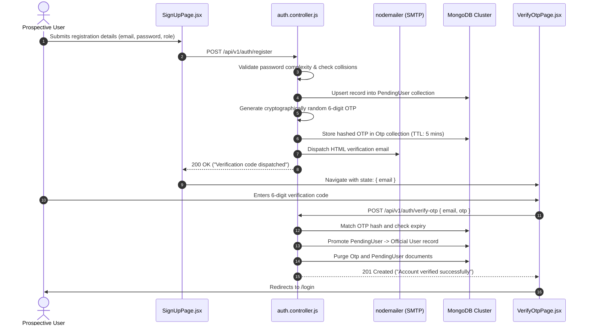

# Merch4Change — Developer Guide & System Handbook

<div align="center">

**Department of Computer Engineering · Faculty of Engineering · University of Peradeniya**  
**CO2060 — 2nd Year Project (2YP) · Academic Year 2025/2026**

---

### *Comprehensive Technical Architecture, Database Specifications, Security Framework, Feature Suite & API Reference*

---

| **Project Title** | Merch4Change (CO2060 2YP) |
|---|---|
| **Development Team** | Team Antigravity (Group 13) |
| **Document Version** | 1.0.0 (Production & Evaluation Release) |
| **Frontend Stack** | React 19 · Vite 7 · Tailwind CSS · React Router v7 · React-Leaflet |
| **Backend Stack** | Node.js (>=18.0.0, ES Modules) · Express.js 4 · Mongoose 8 · MongoDB Atlas |
| **Security & Auth** | Dual-Token JWT (Access + HttpOnly Cookie Refresh) · Bcrypt · Email OTP · RBAC |
| **Media Storage** | Cloudinary CDN via Multer Memory Stream |
| **Target Audience** | Software Engineers, DevOps Engineers, Academic Evaluators & Contributors |

</div>

---

## Table of Contents

1. [Executive Summary & System Vision](#1-executive-summary--system-vision)
   - [1.1 The Problem Space](#11-the-problem-space)
   - [1.2 Our Solution: The Merch-to-Impact Model](#12-our-solution-the-merch-to-impact-model)
   - [1.3 Core User Personas & Permissions](#13-core-user-personas--permissions)
2. [High-Level System Architecture](#2-high-level-system-architecture)
   - [2.1 Architectural Tier Layout](#21-architectural-tier-layout)
   - [2.2 End-to-End Request Pipeline & Middleware Chain](#22-end-to-end-request-pipeline--middleware-chain)
   - [2.3 Reverse Proxy & Production Ingress](#23-reverse-proxy--production-ingress)
3. [Technology Stack & Dependency Matrix](#3-technology-stack--dependency-matrix)
   - [3.1 Frontend Dependencies](#31-frontend-dependencies)
   - [3.2 Backend Dependencies](#32-backend-dependencies)
   - [3.3 Tooling & Development Utilities](#33-tooling--development-utilities)
4. [Local Development Setup & Getting Started](#4-local-development-setup--getting-started)
   - [4.1 Prerequisites](#41-prerequisites)
   - [4.2 Step-by-Step Installation](#42-step-by-step-installation)
   - [4.3 Database Seeding & Mock Credentials](#43-database-seeding--mock-credentials)
   - [4.4 Running Servers & Port Allocation](#44-running-servers--port-allocation)
5. [Environment Variables Reference](#5-environment-variables-reference)
   - [5.1 Backend Environment Configuration (`.env`)](#51-backend-environment-configuration-env)
   - [5.2 Frontend Environment Configuration (`.env`)](#52-frontend-environment-configuration-env)
   - [5.3 Production Security Guidelines for Secrets](#53-production-security-guidelines-for-secrets)
6. [Database Schema & Mongoose Data Architecture](#6-database-schema--mongoose-data-architecture)
   - [6.1 Entity-Relationship Overview](#61-entity-relationship-overview)
   - [6.2 Complete Mongoose Models Catalog (27 Models)](#62-complete-mongoose-models-catalog-27-models)
   - [6.3 Detailed Schema Definitions & Constraints](#63-detailed-schema-definitions--constraints)
   - [6.4 Compound Indices & Performance Optimization](#64-compound-indices--performance-optimization)
7. [Security, Authentication & Authorization Engine](#7-security-authentication--authorization-engine)
   - [7.1 Dual-Token JWT Architecture (XSS & CSRF Defense)](#71-dual-token-jwt-architecture-xss--csrf-defense)
   - [7.2 Silent Token Refresh & Concurrency Queue (`apiClient.js`)](#72-silent-token-refresh--concurrency-queue-apiclientjs)
   - [7.3 Email OTP Onboarding Lifecycle](#73-email-otp-onboarding-lifecycle)
   - [7.4 Role-Based Access Control (RBAC)](#74-role-based-access-control-rbac)
   - [7.5 Network Defense: Helmet, CORS & Rate Limiting](#75-network-defense-helmet-cors--rate-limiting)
8. [Comprehensive Feature Specifications (Features 01–17)](#8-comprehensive-feature-specifications-features-0117)
   - [Feature 01: Coin Donations & Social Impact Engine](#feature-01-coin-donations--social-impact-engine)
   - [Feature 02: Authentication & Session Management](#feature-02-authentication--session-management)
   - [Feature 03: Marketplace & Multi-Vendor Product Catalog](#feature-03-marketplace--multi-vendor-product-catalog)
   - [Feature 04: Order Checkout & Coin Reward Engine](#feature-04-order-checkout--coin-reward-engine)
   - [Feature 05: Auctions & Real-Time Bidding System](#feature-05-auctions--real-time-bidding-system)
   - [Feature 06: Charities & NGO Verification Workflow](#feature-06-charities--ngo-verification-workflow)
   - [Feature 07: Charitable Projects & Fundraising Campaigns](#feature-07-charitable-projects--fundraising-campaigns)
   - [Feature 08: Organization HQ Geolocation & Interactive Mapping](#feature-08-organization-hq-geolocation--interactive-mapping)
   - [Feature 09: Unified Profiles & Social Follow System](#feature-09-unified-profiles--social-follow-system)
   - [Feature 10: Community Posts, Optimistic Likes & Comments](#feature-10-community-posts-optimistic-likes--comments)
   - [Feature 11: Ephemeral Stories & Highlight Collections](#feature-11-ephemeral-stories--highlight-collections)
   - [Feature 12: Direct Messaging System](#feature-12-direct-messaging-system)
   - [Feature 13: In-App Notifications System](#feature-13-in-app-notifications-system)
   - [Feature 14: Leaderboards, Donor Tiers & Gamified Badges](#feature-14-leaderboards-donor-tiers--gamified-badges)
   - [Feature 15: Global Multi-Entity Search Engine](#feature-15-global-multi-entity-search-engine)
   - [Feature 16: Admin Moderation & Verification Portal](#feature-16-admin-moderation--verification-portal)
   - [Feature 17: Cloud Media Upload Pipeline](#feature-17-cloud-media-upload-pipeline)
9. [REST API Directory & Endpoint Specifications](#9-rest-api-directory--endpoint-specifications)
   - [9.1 Standard Response Contract](#91-standard-response-contract)
   - [9.2 Authentication Endpoints (`/api/v1/auth`)](#92-authentication-endpoints-apiv1auth)
   - [9.3 Marketplace & Product Endpoints (`/api/v1/marketplace`, `/api/v1/products`)](#93-marketplace--product-endpoints-apiv1marketplace-apiv1products)
   - [9.4 Donations & Philanthropy Endpoints (`/api/v1/donations`)](#94-donations--philanthropy-endpoints-apiv1donations)
   - [9.5 Charities & Organization Endpoints (`/api/v1/charities`, `/api/v1/orgs`)](#95-charities--organization-endpoints-apiv1charities-apiv1orgs)
   - [9.6 Admin Moderation Endpoints (`/api/v1/admin`)](#96-admin-moderation-endpoints-apiv1admin)
   - [9.7 Social Feed & Stories Endpoints (`/api/v1/posts`, `/api/v1/stories`)](#97-social-feed--stories-endpoints-apiv1posts-apiv1stories)
   - [9.8 Direct Messaging Endpoints (`/api/v1/messages`)](#98-direct-messaging-endpoints-apiv1messages)
   - [9.9 Notifications Endpoints (`/api/v1/notifications`)](#99-notifications-endpoints-apiv1notifications)
   - [9.10 Leaderboards Endpoints (`/api/v1/leaderboards`)](#910-leaderboards-endpoints-apiv1leaderboards)
   - [9.11 Global Search Endpoint (`/api/search`)](#911-global-search-endpoint-apisearch)
10. [Frontend Architecture & State Management](#10-frontend-architecture--state-management)
    - [10.1 Directory Layout & Component Hierarchy](#101-directory-layout--component-hierarchy)
    - [10.2 React Router v7 Routing & Route Guards](#102-react-router-v7-routing--route-guards)
    - [10.3 Context Providers (`AuthContext`, `ThemeContext`)](#103-context-providers-authcontext-themecontext)
    - [10.4 HTTP Client Architecture (`apiClient.js`)](#104-http-client-architecture-apiclientjs)
    - [10.5 UI Styling System & Glassmorphism with Tailwind CSS](#105-ui-styling-system--glassmorphism-with-tailwind-css)
11. [Testing Strategy & Quality Assurance](#11-testing-strategy--quality-assurance)
    - [11.1 Backend Unit & Integration Testing (Node.js Test Runner)](#111-backend-unit--integration-testing-nodejs-test-runner)
    - [11.2 Frontend Component & Unit Testing (Vitest + RTL)](#112-frontend-component--unit-testing-vitest--rtl)
    - [11.3 Code Quality & Linting (ESLint 9 + Prettier)](#113-code-quality--linting-eslint-9--prettier)
12. [Development Standards, Git Workflow & Team Protocols](#12-development-standards-git-workflow--team-protocols)
    - [12.1 Git Branching Model](#121-git-branching-model)
    - [12.2 Conventional Commits Specification](#122-conventional-commits-specification)
    - [12.3 Code Conventions & Idiomatic Patterns](#123-code-conventions--idiomatic-patterns)
    - [12.4 Pull Request Review Guidelines](#124-pull-request-review-guidelines)
13. [DevOps, Deployment & Production Operations](#13-devops-deployment--production-operations)
    - [13.1 Frontend Hosting on Vercel](#131-frontend-hosting-on-vercel)
    - [13.2 Backend Cloud Ingress & Containerization](#132-backend-cloud-ingress--containerization)
    - [13.3 Database Operations on MongoDB Atlas](#133-database-operations-on-mongodb-atlas)
    - [13.4 Cloudinary Media Delivery & CDN Policies](#134-cloudinary-media-delivery--cdn-policies)
14. [Developer FAQ & Troubleshooting Matrix](#14-developer-faq--troubleshooting-matrix)
15. [Academic Credits, Team Antigravity & Acknowledgements](#15-academic-credits-team-antigravity--acknowledgements)

---

## 1. Executive Summary & System Vision

### 1.1 The Problem Space
In the modern e-commerce landscape, three disconnected sectors exist with significant frictions:
1. **Conscious Consumers & Fans**: Eager to support social, environmental, and humanitarian causes, but lack verifiable transparency and direct avenues linking their regular lifestyle merchandise shopping to philanthropy.
2. **Charities, Non-Profits & NGOs**: Severely restricted by high donor acquisition costs, discoverability hurdles, and skepticism surrounding the legitimacy of online fund collection.
3. **Merchants, Creators & Commercial Brands**: Seeking actionable ways to implement authentic Corporate Social Responsibility (CSR) that demonstrably engages young, purpose-driven consumers.

### 1.2 Our Solution: The Merch-to-Impact Model
**Merch4Change** bridges these sectors into a unified digital ecosystem powered by a transparent **Merch-to-Impact** flywheel:
- **Earn on Purchase**: Every time a consumer buys merchandise from verified brand storefronts or independent community sellers, the platform automatically mints **Merch Coins** rewarded at:
  $$\text{Coins Earned} = \left\lfloor \frac{\text{Order Total (USD)}}{10} \right\rfloor$$
- **Atomic Philanthropic Giving**: Users donate their accumulated coins directly to admin-verified non-profits or targeted, time-bound charitable campaigns.
- **Auditable & Concurrency-Safe**: Database transactions atomically update donor balances and project milestones, preventing double-spending and guaranteeing that every coin is tracked.
- **Social Gamification**: Tiered badges (**Bronze**, **Silver**, **Gold**, **Platinum**, **Diamond**), dynamic leaderboards, and social feeds convert philanthropy into an engaging community experience.

### 1.3 Core User Personas & Permissions

```
┌──────────────────────────────────────────────────────────────────────────────┐
│                               USER ROLES MATRIX                              │
├─────────────────┬──────────┬──────────┬──────────┬───────────────────────────┤
│ Capability      │ Shopper  │ Brand    │ Charity  │ Platform Admin            │
├─────────────────┼──────────┼──────────┼──────────┼───────────────────────────┤
│ Browse Products │   ✅     │   ✅     │   ✅     │   ✅                      │
│ Place Orders    │   ✅     │   ✅     │   ✅     │   ✅                      │
│ Earn Coins      │   ✅     │   ✅     │   ✅     │   ✅                      │
│ Donate Coins    │   ✅     │   ✅     │   ✅     │   ✅                      │
│ Upload Merch    │   ✅     │   ✅     │   ❌     │   ✅                      │
│ Brand Storefront│   ❌     │   ✅     │   ❌     │   ✅                      │
│ Launch Campaigns│   ❌     │   ❌     │   ✅     │   ✅                      │
│ Verify Charity  │   ❌     │   ❌     │   ❌     │   ✅ (Full Audit Queue)   │
│ Moderate Feed   │   ❌     │   ❌     │   ❌     │   ✅                      │
└─────────────────┴──────────┴──────────┴──────────┴───────────────────────────┘
```

---

## 2. High-Level System Architecture

### 2.1 Architectural Tier Layout

```
┌─────────────────────────────────────────────────────────────────────────────┐
│                          PRESENTATION / CLIENT TIER                         │
│   React 19  ·  Vite 7  ·  Tailwind CSS  ·  React Router v7  ·  React-Leaflet │
│                  Hosted on Vercel Global Edge Network                       │
└──────────────────────────────────────┬──────────────────────────────────────┘
                                       │ HTTPS (JSON Payloads + HttpOnly Cookies)
┌──────────────────────────────────────▼──────────────────────────────────────┐
│                     API GATEWAY & REVERSE PROXY LAYER                       │
│    Node.js (v18+ LTS, ES Modules)  ·  Express.js 4  ·  Helmet  ·  CORS      │
│    API Rate Limiting  ·  Cookie Parser  ·  Morgan Structured Logging        │
├─────────────────────────────────────────────────────────────────────────────┤
│                         DOMAIN CONTROLLER SERVICES                          │
│ ┌───────────────────────────┬───────────────────────────┬─────────────────┐ │
│ │ Auth & Email OTP Engine   │ Marketplace & Inventory   │ Atomic Donation │ │
│ ├───────────────────────────┼───────────────────────────┼─────────────────┤ │
│ │ Profiles & Social Graphs  │ Posts, Stories & Comments │ Real-Time Direct│ │
│ │                           │                           │ Messaging Engine│ │
│ ├───────────────────────────┼───────────────────────────┼─────────────────┤ │
│ │ Charity Verification Queue│ Gamified Leaderboard Tiers│ Global Search   │ │
│ └───────────────────────────┴───────────────────────────┴─────────────────┘ │
└──────────────────────┬───────────────────────────────┬──────────────────────┘
                       │                               │
       Binary Stream   │                               │ Mongoose ODM v8
     (Multer Memory)   │                               │ (BSON Over TLS)
┌──────────────────────▼───────┐             ┌─────────▼──────────────────────┐
│        ASSET STORAGE         │             │       DATABASE CLUSTER         │
│   Cloudinary CDN & Media     │             │    MongoDB Atlas / Replica     │
│   Optimization Engine        │             │    (27 Managed Collections)    │
└──────────────────────────────┘             └────────────────────────────────┘
```

### 2.2 End-to-End Request Pipeline & Middleware Chain

Every inbound HTTP request traverses a hardened middleware pipeline before hitting domain logic:

```
[ Incoming HTTP Request ]
          │
          ▼
1. app.set("trust proxy", 1)       --> Correctly resolves client IP behind Vercel/Railway proxies
          │
          ▼
2. helmet()                        --> Injects security headers (X-Frame-Options, CSP, HSTS)
          │
          ▼
3. cors({ origin, credentials })   --> Enforces cross-origin policies and cookie transmission
          │
          ▼
4. express.json({ limit: "1mb" })  --> Parses JSON body payloads (guarded against payload bombing)
          │
          ▼
5. cookieParser()                  --> Extracts secure HttpOnly refresh token cookies
          │
          ▼
6. express.urlencoded()            --> Decodes form submissions
          │
          ▼
7. morgan() + logger.js            --> Sanitizes request parameters and emits structured access logs
          │
          ▼
8. apiRateLimiter (300 req/15m)    --> Protects all /api/v1 routes against volumetric DoS
          │
          ▼
9. [ Specific Route Gateways ]
   ├── authRateLimiter (20/15m)    --> Brute-force protection on /api/v1/auth routes
   ├── protect (auth.js)           --> Decodes & verifies in-memory Bearer JWT access token
   ├── requireRole([...])          --> Enforces RBAC permissions ("admin", "charity", etc.)
   └── upload.single("image")      --> Buffers multipart uploads in RAM for Cloudinary streaming
          │
          ▼
10. Domain Controller Logic        --> Executes atomic database operations and business rules
          │
          ▼
11. Response Dispatcher
   ├── successResponse()           --> Dispatches standardized { success: true, message, data }
   └── errorHandler.js             --> Normalizes AppError, Mongo 11000 duplicate keys & 500s
```

### 2.3 Reverse Proxy & Production Ingress
When deployed on modern hosting infrastructure (Vercel, Railway, Render, or Docker behind Nginx), Express is set behind reverse proxies. Merch4Change configures:
```javascript
app.set("trust proxy", 1);
```
This guarantees that `req.ip` reflects the actual remote client IP rather than the proxy load balancer's internal IP, which is essential for accurate `express-rate-limit` enforcement and security audit logging.

---

## 3. Technology Stack & Dependency Matrix

### 3.1 Frontend Dependencies (`code/Frontend/package.json`)

| Package | Version | Purpose & Architectural Role |
|---|---|---|
| **react** | `^19.2.0` | UI component library utilizing React 19 concurrent features. |
| **react-dom** | `^19.2.0` | Browser rendering target for React 19. |
| **vite** | `^7.2.4` | Ultra-fast build tool and development server with Hot Module Replacement (HMR). |
| **react-router-dom** | `^7.13.1` | Client-side routing, protected route wrappers, and polymorphic URL management. |
| **tailwindcss** | `^3.4.19` | Utility-first CSS framework powering the responsive glassmorphism UI design. |
| **axios** | `^1.15.2` | Promise-based HTTP client equipped with request/response interceptors for silent token refresh. |
| **leaflet** | `^1.9.4` | Core interactive mobile-friendly mapping library. |
| **react-leaflet** | `^5.0.0` | React wrapper bindings for Leaflet maps to plot charity HQs. |
| **lucide-react** | `^0.577.0` | High-consistency vector iconography across the platform. |
| **react-hot-toast** | `^2.6.0` | Lightweight animated notification toasts for transactional events. |
| **@vercel/analytics** | `^2.0.1` | Production real-user monitoring and telemetry. |

### 3.2 Backend Dependencies (`code/Backend/package.json`)

| Package | Version | Purpose & Architectural Role |
|---|---|---|
| **node** | `>=18.0.0` | Modern JavaScript runtime executing native ES Modules (`"type": "module"`). |
| **express** | `^4.22.1` | Lightweight, unopinionated web framework powering the REST API. |
| **mongoose** | `^8.23.1` | Object Data Modeling (ODM) library for MongoDB validation, querying, and schema definition. |
| **jsonwebtoken** | `^9.0.2` | Cryptographic generation and verification of access and refresh JWT tokens. |
| **bcryptjs** | `^2.4.3` | Optimized password hashing using salted bcrypt algorithms. |
| **cookie-parser** | `^1.4.7` | Secure cookie deserialization for HttpOnly refresh tokens. |
| **cors** | `^2.8.5` | Cross-Origin Resource Sharing middleware configured with credentials support. |
| **helmet** | `^8.0.0` | Security header injection (Content-Security-Policy, anti-clickjacking, DNS prefetch). |
| **express-rate-limit**| `^8.3.2` | Memory-based rate limiter guarding public APIs and authentication routes. |
| **multer** | `^2.1.1` | Multipart form-data parser storing media in temporary memory buffers (`MemoryStorage`). |
| **cloudinary** | `^2.10.0` | Cloudinary v2 SDK for enterprise image hosting, compression, and delivery. |
| **streamifier** | `^0.1.1` | Converts Multer memory buffers into readable NodeJS streams for direct Cloudinary uploads. |
| **nodemailer** | `^9.0.1` | SMTP email client delivering 6-digit Time-based OTP verification codes. |
| **morgan** | `^1.10.0` | HTTP request logging middleware configured with sensitive token redaction. |
| **dotenv** | `^16.6.1` | Environment variable loader populating `process.env`. |

### 3.3 Tooling & Development Utilities

| Tool | Version | Purpose |
|---|---|---|
| **vitest** | `^3.2.4` | Ultra-fast Vite-native testing framework for frontend unit and hook tests. |
| **@testing-library/react** | `^16.3.0` | Idiomatic React UI testing utilities focusing on user interactions. |
| **jsdom** | `^27.2.0` | DOM simulation environment for headless browser testing in Vitest. |
| **Node.js Test Runner** | Built-in | Native zero-dependency test runner (`node --test`) executing backend unit & integration tests. |
| **eslint** | `^9.39.4` | Static code analysis and linting enforcing syntax and structural standards. |
| **prettier** | `^3.8.1` | Code formatting engine ensuring consistent whitespace and style across the codebase. |
| **nodemon** | `^3.1.7` | Development utility automatically restarting the Node server on file changes. |

---

## 4. Local Development Setup & Getting Started

### 4.1 Prerequisites
Ensure the development machine meets the following minimum requirements:
- **Node.js**: `v18.0.0` or higher (verified via `node -v`)
- **npm**: `v9.0.0` or higher (verified via `npm -v`)
- **MongoDB**: A running local instance (`mongodb://127.0.0.1:27017`) or a free-tier **MongoDB Atlas** connection string
- **Git**: Installed and configured with your GitHub credentials
- **Cloudinary Account**: Free-tier cloud credentials for image storage (optional for pure mock testing)
- **SMTP Credentials**: Gmail App Password or Mailtrap testing credentials for OTP delivery

---

### 4.2 Step-by-Step Installation

#### Step 1: Clone the Repository
```bash
git clone https://github.com/cepdnaclk/e23-co2060-Merch4Change.git
cd e23-co2060-Merch4Change
```

#### Step 2: Configure and Install Backend
```bash
cd code/Backend
npm install
```
Create the `.env` file from the reference in [Section 5.1](#51-backend-environment-configuration-env):
```bash
cp .env.example .env  # or create manually
```

#### Step 3: Configure and Install Frontend
```bash
cd ../Frontend
npm install
```
Create the `.env` file:
```bash
echo "VITE_API_URL=http://localhost:5000" > .env
```

---

### 4.3 Database Seeding & Mock Credentials

The backend includes a comprehensive idempotent database seeding script that purges test databases and loads mock users, luxury merchandise, verified non-profits, and active fundraising campaigns.

From `code/Backend`:
```bash
node src/scripts/seed.js
```

#### Seeded Test Accounts (Master Password: `Password123!`)

| Account Type | Email | Username | Purpose / Role | Initial Coin Balance |
|---|---|---|---|:---:|
| **Platform Admin** | `admin@merch4change.test` | `platformadmin` | Admin dashboard, charity approvals, moderation | 0 |
| **Individual Donor** | `sarah@test.com` | `sarah_gives` | Verified user with high coin balance | 3,200 |
| **Individual Donor** | `aiden@example.com` | `aidensilva` | Active donor & marketplace buyer | 1,850 |
| **Individual Donor** | `elena@test.com` | `elena_eco` | Environmental cause supporter | 950 |
| **Individual Donor** | `marcus@test.com` | `marcus_c` | General shopper & community poster | 620 |
| **Individual Donor** | `maya@test.com` | `mayap` | New community donor | 340 |
| **Verified Charity** | `contact@globalwildlife.org` | `globalwildlife` | Non-profit with active environmental campaigns | 0 |
| **Verified Charity** | `hello@oceanclean.org` | `oceanclean` | Ocean cleanup initiatives & project target goals | 0 |
| **Luxury Brand** | `store@ferrari.test` | `ferrari_official` | Official brand merchant with high-value merch | 0 |

---

### 4.4 Running Servers & Port Allocation

| Service | Command | Local URL | Port |
|---|---|---|:---:|
| **Backend API Server** | `cd code/Backend && npm run dev` | `http://localhost:5000` | `5000` |
| **Frontend Vite Client** | `cd code/Frontend && npm run dev` | `http://localhost:5173` | `5173` |
| **MongoDB Database** | Local service / Atlas cluster | `mongodb://127.0.0.1:27017/merch4change` | `27017` |

---

## 5. Environment Variables Reference

### 5.1 Backend Environment Configuration (`code/Backend/.env`)

```env
# ── Server & Runtime ──────────────────────────────────────────────
PORT=5000
NODE_ENV=development
FRONTEND_URL=http://localhost:5173

# ── Database Connection ───────────────────────────────────────────
MONGODB_URI=mongodb://127.0.0.1:27017/merch4change

# ── JWT Authentication (Dual-Token Security) ──────────────────────
JWT_SECRET=super_secret_access_token_key_change_in_production_32chars
JWT_EXPIRES_IN=15m
JWT_REFRESH_SECRET=super_secret_refresh_token_key_change_in_production_32chars
JWT_REFRESH_EXPIRES_IN=60d

# ── Cloudinary Media CDN Storage ──────────────────────────────────
CLOUDINARY_CLOUD_NAME=your_cloudinary_cloud_name
CLOUDINARY_API_KEY=your_cloudinary_api_key
CLOUDINARY_API_SECRET=your_cloudinary_api_secret

# ── Email OTP Service (Nodemailer SMTP) ───────────────────────────
EMAIL_USER=your_email@gmail.com
EMAIL_PASS=your_gmail_16_character_app_password
OTP_EXPIRE_MIN=5

# ── Rate Limiting Configurations (Optional Tuning) ─────────────────
API_RATE_LIMIT_WINDOW_MS=900000
API_RATE_LIMIT_MAX=300
AUTH_RATE_LIMIT_WINDOW_MS=900000
AUTH_RATE_LIMIT_MAX=20
```

### 5.2 Frontend Environment Configuration (`code/Frontend/.env`)

```env
# URL pointing to the running Express REST API server
VITE_API_URL=http://localhost:5000
```

### 5.3 Production Security Guidelines for Secrets
- **Never commit `.env` files**: Both `code/Backend/.env` and `code/Frontend/.env` are strictly excluded in `.gitignore`.
- **Secret Entropy**: `JWT_SECRET` and `JWT_REFRESH_SECRET` must be cryptographically generated strings of at least 32 characters (`openssl rand -base64 32`).
- **HttpOnly Cookies**: In production (`NODE_ENV=production`), refresh token cookies are flagged with `secure: true`, forcing transport over HTTPS only.

---

## 6. Database Schema & Mongoose Data Architecture

### 6.1 Entity-Relationship Overview

```
 ┌───────────────┐           ┌────────────────────┐           ┌──────────────────┐
 │     User      │ 1       1 │OrganizationProfile │           │     Charity      │
 │  (Individual  ├───────────┤  (Brand / Charity) │           │  (Verification & │
 │   or Org)     │           └────────────────────┘           │   Compliance)    │
 └───┬───┬───┬───┘                                            └────────┬─────────┘
     │   │   │                                                         │ 1
     │   │   │ 1                                                       │
     │   │   └───────────────────────┐                                 │ has many
     │   │                           │                                 │
     │   │ 1                         │                                 ▼
     │   ▼                           ▼                        ┌──────────────────┐
     │ ┌────────────────┐      ┌────────────────┐             │     Project      │
     │ │     Order      │      │    Product     │             │ (Campaign Target)│
     │ │ (Items, Coins) │      │ (Catalog Item) │             └────────┬─────────┘
     │ └───────┬────────┘      └────────────────┘                      ▲
     │         │                                                       │
     │         ▼                                                       │
     │ ┌────────────────┐                                              │
     │ │CoinTransaction │                                              │
     │ └────────────────┘                                              │
     │                                                                 │
     │ 1                      has many                                 │
     └─────────────────────────────────────────────────────────────────┘
                               Donation
```

### 6.2 Complete Mongoose Models Catalog (27 Models)

The backend data architecture is composed of 27 modular schemas located in `code/Backend/src/models/`:

| Model File | Domain | Primary Purpose & Relationships |
|---|---|---|
| `User.js` | Identity | Core account entity (roles: `user`, `brand`, `charity`, `admin`), balances, password hashes. |
| `PendingUser.js` | Onboarding | Temporary staging storage for registrations pending OTP confirmation. |
| `Otp.js` | Verification | 6-digit cryptographic OTP hashes with automatic TTL expiration. |
| `OtpResendRecord.js` | Anti-Abuse | Tracks OTP resend attempts to prevent email flooding. |
| `OrganizationProfile.js`| Organizations | Metadata for brands/charities (mission, registration, social handles). |
| `Brand.js` | Merchants | Storefront configuration, featured products, corporate philanthropy. |
| `Charity.js` | Non-Profits | Registration proof documents, compliance categories, verification statuses. |
| `Project.js` | Philanthropy | Time-bound charitable initiative campaigns with goal and collected amounts. |
| `Donation.js` | Philanthropy | Atomic coin contributions linking a donor, a charity, and optional project. |
| `CoinTransaction.js`| Ledger | Immutable audit log of all coin balance adjustments (`earn`, `donate`, `adjust`). |
| `Product.js` | E-Commerce | Store products with price, stock, brand reference, and Cloudinary media URLs. |
| `Order.js` | E-Commerce | Completed shopping cart snapshots, total amount, coin rewards earned. |
| `Review.js` | E-Commerce | Product reviews, star ratings, and community feedback. |
| `Auction.js` | Marketplace | Limited-edition scheduled drops, start/current prices, bid increments. |
| `Bid.js` | Marketplace | Individual historical bids linked to auctions and bidding users. |
| `Conversation.js` | Messaging | 1-on-1 direct messaging threads with deterministic `participantKey`. |
| `Message.js` | Messaging | Individual chat messages with text content, timestamps, and read receipts. |
| `Notification.js` | Real-time | In-app alerts for donations, orders, post likes, comments, and bid updates. |
| `Post.js` | Social | Feed posts with media attachments, likes count, and threaded comments. |
| `Like.js` | Social | Polymorphic like records tracking user engagement. |
| `Follow.js` | Social | Directed graph tracking followers and following relationships. |
| `Story.js` | Social | 24-hour ephemeral photo/video stories with TTL expiration. |
| `StoryCollection.js`| Social | Permanent highlight collections on profiles grouping expired stories. |
| `Badge.js` | Gamification | Static metadata for donor badges and milestones. |
| `UserBadge.js` | Gamification | Unlocked badges assigned to individual users based on coin milestones. |
| `HomeBanner.js` | Marketing | Dynamic carousel banners displayed on the landing page hero section. |
| `index.js` | Central Export | Barrel file bundling and initializing all Mongoose models. |

---

### 6.3 Detailed Schema Definitions & Constraints

#### A. User Model (`code/Backend/src/models/User.js`)
```javascript
{
  userName: { type: String, required: true, unique: true, trim: true, minlength: 3, maxlength: 30 },
  email: { type: String, required: true, unique: true, lowercase: true, trim: true },
  password: { type: String, required: true, select: false },
  role: { type: String, enum: ["user", "brand", "charity", "admin"], default: "user" },
  accountType: { type: String, enum: ["individual", "organization"], default: "individual" },
  coinBalance: { type: Number, default: 0, min: 0 },
  isVerified: { type: Boolean, default: false },
  profileImageUrl: { type: String, default: "" },
  bio: { type: String, maxlength: 500, default: "" }
}
```

#### B. Charity Model (`code/Backend/src/models/Charity.js`)
```javascript
{
  ownerUserId: { type: ObjectId, ref: "User", required: true, unique: true, index: true },
  publicName: { type: String, required: true, trim: true, minlength: 2, maxlength: 150 },
  legalName: { type: String, trim: true, maxlength: 200, default: "" },
  description: { type: String, trim: true, maxlength: 10000, default: "" },
  logoUrl: { type: String, trim: true, maxlength: 500, default: "" },
  registrationNumber: { type: String, trim: true, maxlength: 100, default: "" },
  category: { 
    type: String, 
    enum: ["health", "education", "environment", "humanitarian", "animal", "other"], 
    default: "other" 
  },
  country: { type: String, trim: true, maxlength: 100, default: "" },
  address: { type: String, trim: true, maxlength: 500, default: "" },
  proofDocuments: [{
    label: { type: String, required: true, maxlength: 120 },
    url: { type: String, required: true, maxlength: 1000 },
    uploadedAt: { type: Date, default: Date.now }
  }],
  verificationStatus: { 
    type: String, 
    enum: ["unsubmitted", "pending", "verified", "rejected"], 
    default: "unsubmitted", 
    index: true 
  },
  rejectionReason: { type: String, default: "" }
}
```

#### C. Order Model (`code/Backend/src/models/Order.js`)
```javascript
{
  userId: { type: ObjectId, ref: "User", required: true, index: true },
  items: [{
    productId: { type: ObjectId, ref: "Product", required: true },
    titleSnapshot: { type: String, required: true },
    quantity: { type: Number, required: true, min: 1 },
    unitPrice: { type: Number, required: true, min: 0 }
  }],
  currency: { type: String, default: "USD" },
  totalAmount: { type: Number, required: true, min: 0 },
  status: { 
    type: String, 
    enum: ["pending", "paid", "shipped", "completed", "cancelled", "refunded"], 
    default: "pending" 
  },
  coinsEarned: { type: Number, required: true, min: 0, default: 0 }
}
```

### 6.4 Compound Indices & Performance Optimization
To ensure low-latency querying at scale, strategic compound indices are defined across high-throughput collections:
```javascript
// Order queries by status and recency
orderSchema.index({ status: 1, createdAt: -1 });

// User order histories
orderSchema.index({ userId: 1, createdAt: -1 });

// Direct message retrieval within threads
messageSchema.index({ conversationId: 1, createdAt: 1 });

// Deterministic conversation resolution
conversationSchema.index({ participantKey: 1 }, { unique: true });

// Donor audit logs
coinTransactionSchema.index({ userId: 1, createdAt: -1 });
```

---

## 7. Security, Authentication & Authorization Engine

### 7.1 Dual-Token JWT Architecture (XSS & CSRF Defense)

Merch4Change implements a state-of-the-art **Dual-Token** architecture that completely eliminates the vulnerability of storing JWT tokens in vulnerable browser `localStorage` or `sessionStorage`:

```
┌─────────────────────────────────────────────────────────────────────────────┐
│                       DUAL-TOKEN SECURITY BOUNDARY                          │
├───────────────────────────────┬─────────────────────────────────────────────┤
│ In-Memory Access Token (15m)  │ HttpOnly Refresh Token Cookie (60d)         │
├───────────────────────────────┼─────────────────────────────────────────────┤
│ • Stored in React JS runtime  │ • Stored in protected browser cookie jar    │
│ • Sent via Authorization Bearer│ • Inaccessible to document.cookie (No XSS)  │
│ • Short lifespan (15 minutes) │ • Strict SameSite & Secure flags (No CSRF)  │
│ • Decoded by backend protect  │ • Exchanged only at /api/v1/auth/refresh    │
└───────────────────────────────┴─────────────────────────────────────────────┘
```

---

### 7.2 Silent Token Refresh & Concurrency Queue (`apiClient.js`)

When an access token expires, Axios intercepts the resulting `401 Unauthorized`. To prevent dozens of simultaneous requests from triggering a flood of duplicate refresh calls (the "thundering herd" problem), `apiClient.js` buffers concurrent requests into an asynchronous promise queue:

```javascript
// code/Frontend/src/api/apiClient.js
let isRefreshing = false;
let failedQueue = [];

const processQueue = (error, token = null) => {
  failedQueue.forEach(({ resolve, reject }) => {
    if (error) reject(error);
    else resolve(token);
  });
  failedQueue = [];
};

apiClient.interceptors.response.use(
  (response) => response,
  async (error) => {
    const originalRequest = error.config;
    if (error.response?.status !== 401 || originalRequest._retry) {
      return Promise.reject(error);
    }

    if (isRefreshing) {
      return new Promise((resolve, reject) => {
        failedQueue.push({ resolve, reject });
      }).then((token) => {
        originalRequest.headers.Authorization = `Bearer ${token}`;
        return apiClient(originalRequest);
      });
    }

    originalRequest._retry = true;
    isRefreshing = true;

    try {
      const { data } = await axios.post(
        `${API_BASE}/api/v1/auth/refresh`,
        {},
        { withCredentials: true }
      );
      const newToken = data.data.accessToken;
      setAccessToken(newToken);
      processQueue(null, newToken);
      originalRequest.headers.Authorization = `Bearer ${newToken}`;
      return apiClient(originalRequest);
    } catch (refreshError) {
      processQueue(refreshError, null);
      if (typeof _logoutCallback === "function") _logoutCallback();
      return Promise.reject(refreshError);
    } finally {
      isRefreshing = false;
    }
  }
);
```

---

### 7.3 Email OTP Onboarding Lifecycle



---

### 7.4 Role-Based Access Control (RBAC)
Role enforcement is handled via the declarative `requireRole` middleware:
```javascript
// code/Backend/src/middlewares/requireRole.js
export const requireRole = (...allowedRoles) => {
  return (req, res, next) => {
    if (!req.user || !allowedRoles.includes(req.user.role)) {
      return res.status(403).json({
        success: false,
        message: "Forbidden: You lack necessary permissions for this resource.",
      });
    }
    next();
  };
};
```

---

### 7.5 Network Defense: Helmet, CORS & Rate Limiting
- **Helmet**: Disables MIME-type sniffing (`X-Content-Type-Options: nosniff`), enforces `X-Frame-Options: SAMEORIGIN` to stop clickjacking, and injects strict Cross-Origin-Opener policies.
- **CORS**: Configured strictly with `origin: env.frontendUrl` and `credentials: true`. Wildcards (`*`) are disallowed to protect session cookies.
- **Rate Limiters**:
  - `apiRateLimiter`: 300 requests per 15 minutes across general routes.
  - `authRateLimiter`: 20 requests per 15 minutes targeting `/api/v1/auth` to thwart credential-stuffing and brute-force attacks.

---

## 8. Comprehensive Feature Specifications (Features 01–17)

### Feature 01: Coin Donations & Social Impact Engine
- **Purpose**: Enables users to donate earned Merch Coins to verified charities or targeted campaigns.
- **Concurrency Safeguard**: Atomic balance deduction using MongoDB `$inc` with a conditional filter:
  ```javascript
  User.findOneAndUpdate(
    { _id: userId, coinBalance: { $gte: coinAmount } },
    { $inc: { coinBalance: -coinAmount } },
    { new: true }
  );
  ```
- **Business Logic**: Fails with `400 INSUFFICIENT_COINS` if the user's live balance is less than `coinAmount`. Upon success, records a `Donation` document, increments the project's `collectedAmount`, and appends an entry to `CoinTransaction`.

### Feature 02: Authentication & Session Management
- **Purpose**: Issues and revokes dual tokens, supports password hashing with bcrypt, manages email OTP generation and resend rate limits.
- **Key Modules**: `auth.controller.js`, `otp.controller.js`, `auth.js` middleware.

### Feature 03: Marketplace & Multi-Vendor Product Catalog
- **Purpose**: Displays categorized merchandise across brand shops and community sellers.
- **Capabilities**: Filter by price, category, availability, and seller type. Supports pagination (`page`, `limit`), text search, and limited-edition badges.

### Feature 04: Order Checkout & Coin Reward Engine
- **Purpose**: Handles shopping cart checkout, validates stock levels, and computes reward coins:
  $$\text{Coins Earned} = \left\lfloor \frac{\text{totalAmount}}{10} \right\rfloor$$
- **Atomic Operations**: Decrements product inventory and credits coins to the user's `coinBalance` within an audit trail.

### Feature 05: Auctions & Real-Time Bidding System
- **Purpose**: Facilitates time-bound bidding drops on limited-edition merchandise.
- **Bidding Rules**: Enforces `newBid >= currentPrice + bidIncrement`, validates that the auction is in `"active"` status and before `endTime`, and tracks the `currentBidder`.

### Feature 06: Charities & NGO Verification Workflow
- **Purpose**: Onboarding portal for NGOs to upload government registration certificates and tax exemption proofs.
- **Verification States**: `unsubmitted` $\rightarrow$ `pending` $\rightarrow$ `verified` or `rejected`. Admin reviews trigger email alerts and promote the user account to the `"charity"` role.

### Feature 07: Charitable Projects & Fundraising Campaigns
- **Purpose**: Allows verified charities to launch targeted campaigns with designated `goalAmount`.
- **Progress Tracking**: Real-time percentage completion computed on read:
  $$\text{Progress \%} = \min\left(100, \left(\frac{\text{collectedAmount}}{\text{goalAmount}}\right) \times 100\right)$$

### Feature 08: Organization HQ Geolocation & Interactive Mapping
- **Purpose**: Displays charity headquarters on an interactive Leaflet map powered by OpenStreetMap tiles.
- **Implementation**: `react-leaflet` components (`MapContainer`, `TileLayer`, `Marker`, `Popup`) render responsive cards showing charity name, mission, and direct donation buttons.

### Feature 09: Unified Profiles & Social Follow System
- **Purpose**: Polymorphic profile route (`/profile/:username`) serving both individual users and organizations.
- **Social Graph**: Unidirectional following system (`Follow.js`), merchandise shelves, donor histories, and impact stats.

### Feature 10: Community Posts, Optimistic Likes & Comments
- **Purpose**: Public social feed where users share updates, unboxing media, and campaign endorsements.
- **Optimistic Updates**: Likes update instantly in the React client while asynchronously synchronizing via `POST /api/v1/posts/:id/like`.

### Feature 11: Ephemeral Stories & Highlight Collections
- **Purpose**: 24-hour auto-expiring media stories using MongoDB TTL indexes on `expiresAt`.
- **Highlights**: Users can bundle expired stories into permanent profile showcase collections (`StoryCollection.js`).

### Feature 12: Direct Messaging System
- **Purpose**: 1-on-1 private messaging between community members, buyers, and charities.
- **Deterministic Keys**: Prevents duplicate conversation threads using sorted user IDs:
  ```javascript
  const participantKey = [userA, userB].sort().join("_");
  ```

### Feature 13: In-App Notifications System
- **Purpose**: Real-time event notifications for donations, order status updates, post likes, comments, and bid increments.
- **Read Management**: Tracks `isRead: false` counters and provides instant "mark as read" endpoints.

### Feature 14: Leaderboards, Donor Tiers & Gamified Badges
- **Purpose**: Gamified community recognition ranking donors by lifetime and monthly contributions.
- **Tier Boundaries**:
  - **Diamond**: $5,000+$ Coins Donated
  - **Platinum**: $2,000 - 4,999$ Coins
  - **Gold**: $500 - 1,999$ Coins
  - **Silver**: $100 - 499$ Coins
  - **Bronze**: $1 - 99$ Coins

### Feature 15: Global Multi-Entity Search Engine
- **Purpose**: High-performance unified discovery endpoint (`/api/search?q=query`).
- **Parallel Querying**: Utilizes `Promise.all` to query `Product`, `Charity`, `Project`, and `User` concurrently using case-insensitive regex patterns.

### Feature 16: Admin Moderation & Verification Portal
- **Purpose**: Privileged back-office console (`/admin/charities`) for inspecting proof documents, issuing verification approvals, or recording rejection rationales.

### Feature 17: Cloud Media Upload Pipeline
- **Purpose**: Serverless media ingestion streaming directly from client memory to Cloudinary without persisting temporary files to disk.
- **Memory Safety**: Multer enforces a 2MB file buffer limit to prevent server memory exhaustion.

---

## 9. REST API Directory & Endpoint Specifications

### 9.1 Standard Response Contract

Every API endpoint complies with standard JSON payload schemas:

#### Success Envelope (`200 OK`, `201 Created`)
```json
{
  "success": true,
  "message": "Resource retrieved successfully.",
  "data": { ... }
}
```

#### Error Envelope (`400`, `401`, `403`, `404`, `409`, `500`)
```json
{
  "success": false,
  "message": "Human-readable explanation of error.",
  "error": {
    "code": "ERROR_ENUM_CODE",
    "details": null
  }
}
```

---

### 9.2 Authentication Endpoints (`/api/v1/auth`)

| Method | Endpoint | Auth | Description & Payloads |
|---|---|:---:|---|
| `POST` | `/api/v1/auth/register` | Public | Submits registration details and triggers email OTP.<br>**Body**: `{ userName, email, password, role, accountType }` |
| `POST` | `/api/v1/auth/verify-otp` | Public | Verifies OTP and creates official user.<br>**Body**: `{ email, otp }` |
| `POST` | `/api/v1/auth/login` | Public | Authenticates credentials, issues access token, sets refresh cookie.<br>**Body**: `{ identifier, password }` |
| `POST` | `/api/v1/auth/refresh` | Cookie | Exchanges HttpOnly refresh cookie for a fresh access token. |
| `POST` | `/api/v1/auth/logout` | Public | Clears refresh cookie and terminates server session. |
| `GET` | `/api/v1/auth/me` | Bearer | Returns the currently authenticated user session and coin balance. |

---

### 9.3 Marketplace & Product Endpoints (`/api/v1/marketplace`, `/api/v1/products`)

| Method | Endpoint | Auth | Description |
|---|---|:---:|---|
| `GET` | `/api/v1/marketplace` | Public | Browse all published products with query params (`category`, `page`, `limit`, `sort`). |
| `GET` | `/api/v1/products/:id` | Public | Retrieve detailed metadata for a single product. |
| `POST` | `/api/v1/products` | Bearer | Create a new merchandise item.<br>**Body**: `{ name, description, price, stock, category, imageUrl }` |
| `GET` | `/api/v1/products/user/:username` | Public | Fetch all products listed by a specific seller or brand. |

---

### 9.4 Donations & Philanthropy Endpoints (`/api/v1/donations`)

| Method | Endpoint | Auth | Description |
|---|---|:---:|---|
| `POST` | `/api/v1/donations` | Bearer | Atomically donate coins to a charity or project.<br>**Body**: `{ charityId, charityProjectId, coinAmount }` |
| `GET` | `/api/v1/donations/history` | Bearer | Fetch donation transactions made by the authenticated user. |

---

### 9.5 Charities & Organization Endpoints (`/api/v1/charities`, `/api/v1/orgs`)

| Method | Endpoint | Auth | Description |
|---|---|:---:|---|
| `GET` | `/api/v1/charities` | Public | List all approved and verified charities. |
| `POST` | `/api/v1/charities/verify` | Bearer | Submit verification proofs.<br>**Body**: `{ registrationNumber, category, country, address, proofDocuments }` |
| `GET` | `/api/v1/orgs/:username` | Public | Fetch organization profile and project portfolio. |

---

### 9.6 Admin Moderation Endpoints (`/api/v1/admin`)

| Method | Endpoint | Auth | Description |
|---|---|:---:|---|
| `GET` | `/api/v1/admin/charities/pending` | Admin | Retrieve pending charity applications awaiting verification. |
| `POST` | `/api/v1/admin/charities/:id/status`| Admin | Approve or reject a charity verification application.<br>**Body**: `{ status: "verified"|"rejected", rejectionReason }` |

---

### 9.7 Social Feed & Stories Endpoints (`/api/v1/posts`, `/api/v1/stories`)

| Method | Endpoint | Auth | Description |
|---|---|:---:|---|
| `GET` | `/api/v1/posts` | Bearer | Retrieve community feed posts. |
| `POST` | `/api/v1/posts` | Bearer | Create a feed post.<br>**Body**: `{ content, mediaUrl }` |
| `POST` | `/api/v1/posts/:id/like` | Bearer | Toggle like/unlike on a post. |
| `POST` | `/api/v1/posts/:id/comment` | Bearer | Add a comment.<br>**Body**: `{ text }` |
| `GET` | `/api/v1/stories` | Bearer | Retrieve active 24-hour stories. |
| `POST` | `/api/v1/stories` | Bearer | Publish an ephemeral story.<br>**Body**: `{ mediaUrl, caption }` |

---

### 9.8 Direct Messaging Endpoints (`/api/v1/messages`)

| Method | Endpoint | Auth | Description |
|---|---|:---:|---|
| `GET` | `/api/v1/messages/conversations` | Bearer | List conversations with last message and unread counters. |
| `GET` | `/api/v1/messages/:participantId` | Bearer | Fetch message history with a specific user. |
| `POST` | `/api/v1/messages/:participantId` | Bearer | Send a private message.<br>**Body**: `{ body }` |

---

### 9.9 Notifications Endpoints (`/api/v1/notifications`)

| Method | Endpoint | Auth | Description |
|---|---|:---:|---|
| `GET` | `/api/v1/notifications` | Bearer | Fetch recent notifications and unread counts. |
| `PATCH`| `/api/v1/notifications/:id/read`| Bearer | Mark a specific notification as read. |

---

### 9.10 Leaderboards Endpoints (`/api/v1/leaderboards`)

| Method | Endpoint | Auth | Description |
|---|---|:---:|---|
| `GET` | `/api/v1/leaderboards/donors` | Bearer | Get ranked donors across timeframes (`timeframe=week|month|all`). |
| `GET` | `/api/v1/leaderboards/charities` | Public | Get charities ranked by total donations received. |

---

### 9.11 Global Search Endpoint (`/api/search`)

| Method | Endpoint | Auth | Description |
|---|---|:---:|---|
| `GET` | `/api/search?q=query` | Bearer | Parallel cross-entity search returning matched products, charities, campaigns, and users. |

---

## 10. Frontend Architecture & State Management

### 10.1 Directory Layout & Component Hierarchy

```
code/Frontend/src/
├── api/             # Centralized Axios API client and feature service connectors
├── assets/          # Static logos, default avatars, background banners
├── components/      # Reusable UI components (Navbar, Modals, ProtectedRoute, AdminRoute)
├── context/         # React Context providers (AuthContext, ThemeContext)
├── hooks/           # Custom reusable hooks (useSearch, useDebounce)
├── pages/           # Application route views (Landing, Marketplace, Donate, Profile)
├── services/        # Non-React helper functions and formatters
├── App.jsx          # Route hierarchy definition & layout wrapper
└── main.jsx         # React 19 root bootstrap
```

### 10.2 React Router v7 Routing & Route Guards
Routes are segregated into public, authenticated, and role-protected tiers:
```jsx
// Unauthenticated Public Layout
<Route element={<PublicLayout />}>
  <Route path="/" element={<LandingPage />} />
  <Route path="/about/story" element={<OurStory />} />
</Route>

// Authenticated Application Routes
<Route path="/home" element={<ProtectedRoute><Home /></ProtectedRoute>} />
<Route path="/donate" element={<ProtectedRoute><DonatePage /></ProtectedRoute>} />

// Role-Protected Admin Console
<Route path="/admin/charities" element={<AdminRoute><CharityQueue /></AdminRoute>} />
```

### 10.3 Context Providers (`AuthContext`, `ThemeContext`)
- **`AuthContext`**: Manages user authentication state, synchronous memory storage for `accessToken`, login/logout flows, and automatic session restoration on app boot.
- **`ThemeContext`**: Manages light and dark theme classes toggled on the root document element.

### 10.4 HTTP Client Architecture (`apiClient.js`)
Axios is configured as a singleton instance with automatic cookie transmission (`withCredentials: true`) and interceptors for token attachment and 401 retry queuing (detailed in [Section 7.2](#72-silent-token-refresh--concurrency-queue-apiclientjs)).

### 10.5 UI Styling System & Glassmorphism with Tailwind CSS
The application uses modern UI styling patterns:
- **Glassmorphism**: Translucent backdrop blur filters (`backdrop-blur-md bg-white/70 dark:bg-gray-900/70 border border-white/20`).
- **Dark Mode**: Native Tailwind `dark:` variants toggled via context.
- **Micro-Interactions**: Smooth CSS transitions on hover, modal open animations, and loading skeletons.

---

## 11. Testing Strategy & Quality Assurance

### 11.1 Backend Unit & Integration Testing (Node.js Test Runner)
The backend utilizes the native Node.js test runner for speed and zero-dependency overhead.

#### Running Backend Tests
From `code/Backend`:
```bash
# Run all unit tests
npm test

# Run tests in watch mode
npm run test:watch

# Run integration tests
npm run test:integration

# Run all test suites
npm run test:all
```

#### Sample Unit Test (`tests/unit/validators/profile.validator.test.js`)
```javascript
import { describe, it } from "node:test";
import assert from "node:assert/strict";
import { validateProfileUpdate } from "../../../src/validators/profile.validator.js";

describe("Profile Validator Suite", () => {
  it("should accept valid profile update data", () => {
    const input = { bio: "Supporting ocean cleanups", country: "Sri Lanka" };
    const result = validateProfileUpdate(input);
    assert.equal(result.isValid, true);
  });

  it("should reject bios exceeding 500 characters", () => {
    const input = { bio: "a".repeat(501) };
    const result = validateProfileUpdate(input);
    assert.equal(result.isValid, false);
  });
});
```

---

### 11.2 Frontend Component & Unit Testing (Vitest + RTL)
Frontend testing uses **Vitest** paired with **React Testing Library** and **jsdom**.

#### Running Frontend Tests
From `code/Frontend`:
```bash
# Run tests interactively in watch mode
npm test

# Run single CI test pass
npm run test:run
```

---

### 11.3 Code Quality & Linting (ESLint 9 + Prettier)
```bash
# Backend lint check and auto-fix
cd code/Backend && npm run lint && npm run format

# Frontend lint check and auto-fix
cd code/Frontend && npm run lint && npm run format
```

---

## 12. Development Standards, Git Workflow & Team Protocols

### 12.1 Git Branching Model

```
       main (Production Stable)
         ▲
         │ Pull Request (Peer Reviewed)
        dev (Integration Branch)
         ▲
    ┌────┴─────────────────────────┐
    │                              │
feature/charity-verification    fix/token-refresh-loop
```

- `main`: Production release branch. Only deployable commits merged via PRs.
- `dev`: Primary integration branch for sprint deliverables.
- `feature/<name>`: Dedicated branch for specific features.
- `fix/<name>`: Bug fixes and security patches.

---

### 12.2 Conventional Commits Specification
All commit messages must adhere to the **Conventional Commits** standard:
```
<type>(<scope>): <short description>
```

#### Allowed Types:
- `feat`: A new user-facing capability or API endpoint.
- `fix`: A bug fix or patch.
- `docs`: Documentation updates only.
- `style`: Formatting, missing semicolons, whitespace adjustments.
- `refactor`: Code improvements that neither add a feature nor fix a bug.
- `perf`: Performance optimizations.
- `test`: Adding or correcting tests.
- `chore`: Tooling, dependencies, or configuration updates.

#### Examples:
```bash
git commit -m "feat(donations): implement atomic coin deduction with race condition guard"
git commit -m "fix(auth): prevent infinite 401 loop when refresh cookie is expired"
git commit -m "docs(api): document endpoint payloads for charity verification"
```

---

### 12.3 Code Conventions & Idiomatic Patterns
- **React Components**: Named using `PascalCase` (e.g., `ProductCard.jsx`, `VerificationQueue.jsx`).
- **Utilities & Helpers**: Named using `camelCase` (e.g., `apiClient.js`, `formatCurrency.js`).
- **CSS Styling**: Tailored via Tailwind utility classes. Avoid arbitrary raw CSS files where Tailwind classes suffice.
- **Error Handling**: Throw domain `AppError` instances with explicit HTTP status codes; never emit unhandled rejections.

---

### 12.4 Pull Request Review Guidelines
1. Pull Requests must target the `dev` branch.
2. At least one peer review approval is required prior to merging.
3. All automated tests (`npm test`) and linters must pass with zero errors.

---

## 13. DevOps, Deployment & Production Operations

### 13.1 Frontend Hosting on Vercel
- **Edge Deployment**: Frontend is deployed on Vercel's global edge network.
- **Single Page Application (SPA) Rewrites**: Configured via `vercel.json` to ensure deep links (e.g., `/profile/:username`) resolve to `index.html`:
  ```json
  {
    "rewrites": [{ "source": "/(.*)", "destination": "/index.html" }]
  }
  ```

### 13.2 Backend Cloud Ingress & Containerization
- **Runtime**: Node.js v18+ LTS.
- **Process Management**: Can be managed with `pm2` (`pm2 start src/server.js -i max --name merch-backend`) or deployed within minimal Alpine Docker containers.
- **Reverse Proxy**: Set `X-Forwarded-For` and `X-Forwarded-Proto` headers when running behind Nginx or Cloudflare.

### 13.3 Database Operations on MongoDB Atlas
- **Replica Sets**: Mandatory in production to support multi-document ACID transactions.
- **Connection Pooling**: Managed automatically by Mongoose (default `maxPoolSize: 100`).
- **Backups**: Scheduled automated snapshots enabled via Atlas.

### 13.4 Cloudinary Media Delivery & CDN Policies
- **Asset Folders**: Media is segregated into folders (`merch4change/products`, `merch4change/stories`, `merch4change/proofs`).
- **Transformations**: Cloudinary performs automatic WebP/AVIF format negotiation and image compression on the fly.

---

## 14. Developer FAQ & Troubleshooting Matrix

| Problem / Error | Underlying Cause | Verified Resolution |
|---|---|---|
| **CORS policy error on API calls** | `FRONTEND_URL` in backend `.env` does not match the frontend origin. | Ensure `FRONTEND_URL=http://localhost:5173` in backend `.env` exactly matches the port Vite is running on. |
| **Infinite 401 token refresh loop** | The `/api/v1/auth/refresh` endpoint itself returned `401`, triggering repeated retries. | Verified in `apiClient.js`: interceptor explicitly ignores errors on `/auth/refresh` and triggers `_logoutCallback()`. |
| **Nodemailer SMTP authentication failure** | Using raw Gmail account password instead of an App Password. | Generate a 16-character App Password under Google Account Security (requires 2FA) and update `EMAIL_PASS`. |
| **Multer `LIMIT_FILE_SIZE` error** | Uploaded image exceeds the 2MB memory buffer limit. | Compress images before upload or adjust `limits: { fileSize: 5 * 1024 * 1024 }` in `upload.js` if necessary. |
| **MongoDB `E11000 duplicate key error`** | Attempted to insert a record with a taken `email` or `userName`. | Handled automatically by `errorHandler.js`, which parses colliding fields and returns a user-friendly `409 Conflict`. |
| **Leaflet map tiles failing to render** | Missing Leaflet CSS bundle in root application. | Verify `import "leaflet/dist/leaflet.css";` is included in `main.jsx` or the respective map component. |

---

## 15. Academic Credits, Team Antigravity & Acknowledgements

### Academic Affiliation
- **Institution**: Department of Computer Engineering, Faculty of Engineering, University of Peradeniya, Sri Lanka
- **Course**: CO2060 — 2nd Year Project (2YP)
- **Academic Batch**: E23
- **Live Platform URL**: [https://merch4change.vercel.app/](https://merch4change.vercel.app/)
- **Source Repository**: [https://github.com/cepdnaclk/e23-co2060-Merch4Change](https://github.com/cepdnaclk/e23-co2060-Merch4Change)

### Team Antigravity (Group 13)

| Registration No | Student Name | Project Role | Academic Email |
|:---:|:---|:---|:---|
| **E/23/050** | **G.C. Damsiluni** | Frontend Developer & UI/UX Specialist | [e23050@eng.pdn.ac.lk](mailto:e23050@eng.pdn.ac.lk) |
| **E/23/089** | **M.A.S. Dulshara** | Database Systems & Infrastructure Engineer | [e23089@eng.pdn.ac.lk](mailto:e23089@eng.pdn.ac.lk) |
| **E/23/343** | **S.B.N.S. Samarawickrama** | Backend Systems & API Architect | [e23343@eng.pdn.ac.lk](mailto:e23343@eng.pdn.ac.lk) |
| **E/23/347** | **S.D.M.P. Sandanayake** | Team Leader & Full-Stack Systems Engineer | [e23347@eng.pdn.ac.lk](mailto:e23347@eng.pdn.ac.lk) |

### Acknowledgements & Citations
We express our deepest gratitude to the faculty and academic staff of the **Department of Computer Engineering, University of Peradeniya** for their invaluable guidance throughout the ideation, architecture, and execution of the **Merch4Change** project.

---

<div align="center">

**Merch4Change · Team Antigravity · Department of Computer Engineering · University of Peradeniya**  
*“Shop with purpose. Give with every purchase.”*

</div>
