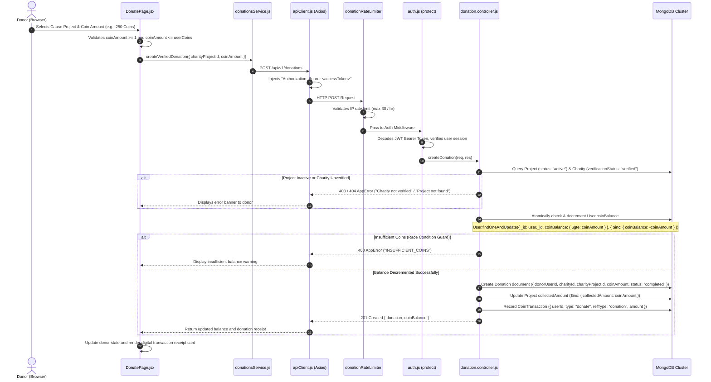

# Feature 01: Coin Donations & Social Impact System

## 1. Executive Summary & Functional Overview
The **Coin Donations & Social Impact System** is the core philanthropic pillar of the Merch4Change platform. It enables community users to transform in-app **Merch Coins** (accumulated from merchandise purchases) into tangible support for verified non-profit organizations, charities, and targeted community projects.

### Key Goals & User Roles
- **Donors (Normal Users)**: Discover verified charities and cause projects, donate in-app coins, track historical donations, view visual donation receipts, and build personal social impact scores.
- **Charities & NGOs**: Receive coin donations allocated to general funds or specific ongoing initiative campaigns, with automatic progress updates toward campaign goals.
- **Platform Integrity**: Ensure donations are only accepted for admin-verified charities and active projects, preventing double-spending via atomic MongoDB operations.

---

## 2. Architecture & Request Lifecycle



---

## 3. Database Models & Schema Specifications

### A. Donation Model (`code/Backend/src/models/Donation.js`)
Represents an individual donation transaction.
```javascript
const donationSchema = new mongoose.Schema(
  {
    donorUserId: {
      type: mongoose.Schema.Types.ObjectId,
      ref: "User",
      required: true,
      index: true,
    },
    charityId: {
      type: mongoose.Schema.Types.ObjectId,
      ref: "Charity",
      required: true,
      index: true,
    },
    charityProjectId: {
      type: mongoose.Schema.Types.ObjectId,
      ref: "Project",
      default: null,
      index: true,
    },
    coinAmount: {
      type: Number,
      required: true,
      min: 1,
    },
    status: {
      type: String,
      enum: ["pending", "completed", "failed"],
      default: "completed",
    },
  },
  { timestamps: true }
);
```

### B. CoinTransaction Model (`code/Backend/src/models/CoinTransaction.js`)
An immutable financial audit log tracking all coin earnings and deductions.
```javascript
const coinTransactionSchema = new mongoose.Schema(
  {
    userId: {
      type: mongoose.Schema.Types.ObjectId,
      ref: "User",
      required: true,
      index: true,
    },
    type: {
      type: String,
      enum: ["earn", "donate", "spend", "refund", "admin_adjustment"],
      required: true,
    },
    amount: {
      type: Number,
      required: true,
      min: 1,
    },
    refType: {
      type: String,
      enum: ["order", "donation", "auction", "reward", "manual"],
      default: "manual",
    },
    refId: {
      type: mongoose.Schema.Types.ObjectId,
      default: null,
    },
  },
  { timestamps: true }
);
```

### C. Project Model (`code/Backend/src/models/Project.js`)
Tracks specific campaigns run by verified charities.
- `goalAmount`: Target coin or currency funding goal.
- `collectedAmount`: Current amount accumulated from donations.
- `status`: `"active" | "completed" | "paused"`.

---

## 4. API Endpoints Reference

Base URL: `/api/v1/donations`

### 1. Create Donation
- **Method**: `POST`
- **Route**: `/api/v1/donations`
- **Access**: Protected (`protect` middleware)
- **Rate Limit**: 30 requests / hour per IP (`donationRateLimiter`)
- **Headers**:
  ```http
  Authorization: Bearer <access_token>
  Content-Type: application/json
  ```
- **Request Body**:
  ```json
  {
    "charityId": "664f1a2b3c4d5e6f7a8b9c0d",
    "charityProjectId": "664f1b3c4d5e6f7a8b9c0e1f",
    "coinAmount": 250
  }
  ```
- **Success Response (`201 Created`)**:
  ```json
  {
    "success": true,
    "statusCode": 201,
    "message": "Donation successful.",
    "data": {
      "donation": {
        "_id": "67cb1a48f321d8b940023a81",
        "donorUserId": "664f0f1a2b3c4d5e6f7a8b9c",
        "charityId": "664f1a2b3c4d5e6f7a8b9c0d",
        "charityProjectId": "664f1b3c4d5e6f7a8b9c0e1f",
        "coinAmount": 250,
        "status": "completed",
        "createdAt": "2026-09-06T10:00:00.000Z",
        "updatedAt": "2026-09-06T10:00:00.000Z"
      },
      "coinBalance": 750
    }
  }
  ```
- **Error Responses**:
  - `400 Bad Request`: `{"success": false, "errorCode": "INSUFFICIENT_COINS", "message": "Insufficient coin balance."}`
  - `403 Forbidden`: `{"success": false, "errorCode": "CHARITY_NOT_VERIFIED", "message": "Donations are only accepted for verified charities."}`
  - `404 Not Found`: `{"success": false, "errorCode": "PROJECT_NOT_FOUND", "message": "Active project not found."}`
  - `429 Too Many Requests`: `{"success": false, "errorCode": "TOO_MANY_REQUESTS", "message": "Donation limit reached. Try again later."}`

### 2. Get My Donations History
- **Method**: `GET`
- **Route**: `/api/v1/donations/my?page=1&limit=10`
- **Access**: Protected (`protect`)
- **Query Params**: `page` (default: 1), `limit` (default: 10, max: 100)
- **Success Response (`200 OK`)**:
  ```json
  {
    "success": true,
    "statusCode": 200,
    "message": "Donations fetched",
    "data": {
      "donations": [
        {
          "_id": "67cb1a48f321d8b940023a81",
          "charity": "Save the Planet",
          "charityLogo": "https://res.cloudinary.com/demo/image/upload/charity1.png",
          "charityCategory": "Environment",
          "project": "Plant 10,000 Mangroves",
          "coinAmount": 250,
          "status": "completed",
          "createdAt": "2026-09-06T10:00:00.000Z"
        }
      ],
      "total": 12,
      "page": 1,
      "pages": 2
    }
  }
  ```

### 3. Get User Impact Metrics & Stats
- **Method**: `GET`
- **Route**: `/api/v1/donations/my/stats`
- **Access**: Protected (`protect`)
- **Description**: Computes total coins donated, unique causes supported, donation counts, an aggregate impact score (0-100), and breakdown of user contributions per project.
- **Success Response (`200 OK`)**:
  ```json
  {
    "success": true,
    "statusCode": 200,
    "message": "Donation stats fetched",
    "data": {
      "totalDonated": 1250,
      "causesSupported": 4,
      "donationCount": 8,
      "impactScore": 82,
      "ongoingProjects": [
        {
          "_id": "664f1b3c4d5e6f7a8b9c0e1f",
          "title": "Clean Water Initiative",
          "goalAmount": 50000,
          "collectedAmount": 18250,
          "userContribution": 500
        }
      ]
    }
  }
  ```

### 4. List Verified Charities for Donations
- **Method**: `GET`
- **Route**: `/api/v1/donations/charities`
- **Access**: Public

### 5. List Active Projects for Donations
- **Method**: `GET`
- **Route**: `/api/v1/donations/projects`
- **Access**: Public

---

## 5. Frontend Client Integration

### Service Layer (`code/Frontend/src/api/donationsService.js`)
```javascript
import apiClient from "./apiClient";

export const getMyDonations = (page = 1) =>
  apiClient.get(`/api/v1/donations/my?page=${page}&limit=10`);

export const getDonationStats = () =>
  apiClient.get("/api/v1/donations/my/stats");

export const createVerifiedDonation = async ({ charityId, charityProjectId, coinAmount }) => {
  return await apiClient.post("/api/v1/donations", {
    charityId,
    charityProjectId: charityProjectId || undefined,
    coinAmount,
  });
};
```

### Component Flow (`code/Frontend/src/pages/Donate/DonatePage.jsx`)
1. **Initial Load**: Fetches donor profile and live coin balance via `/api/v1/profile/me/coins` and active projects via `listDonationProjects()`.
2. **Preset or Custom Selection**: Donors can choose presets (`[25, 50, 100, 250, 500, 1000]`) or input a custom integer.
3. **Optimistic & Live Verification**: Compares `coinAmount` against local `userCoins`.
4. **Execution**: Submits `createVerifiedDonation(payload)`. Upon success:
   - Decrements local `userCoins` to `res.data.data.coinBalance`.
   - Increments local project `collectedAmount`.
   - Displays animated `successReceipt` card with transaction ID and timestamp.

---

## 6. Concurrency, Security & Integrity Guardrails

1. **Atomic Guard Against Race Conditions**:
   `User.findOneAndUpdate` uses the `$gte` condition:
   ```javascript
   const updatedUser = await User.findOneAndUpdate(
     { _id: req.user._id, coinBalance: { $gte: parsedAmount } },
     { $inc: { coinBalance: -parsedAmount } },
     { new: true, runValidators: true }
   );
   ```
   If a user fires multiple simultaneous donation requests, only the request(s) whose balance satisfies `$gte: parsedAmount` will succeed. The rest immediately receive `null`, preventing negative balances.
2. **Strict Verification Check**:
   Before any deduction occurs, the target charity must have `charity.verificationStatus === "verified"`.
3. **Double-Entry Audit**:
   Every coin decrement creates both a `Donation` document and a `CoinTransaction` record with `refType: "donation"`.

---

## 7. Developer Testing & Reproduction Guide

### Test with `cURL`
```bash
# 1. Donate 100 coins to an active project
curl -X POST http://localhost:5000/api/v1/donations \
  -H "Authorization: Bearer <YOUR_ACCESS_TOKEN>" \
  -H "Content-Type: application/json" \
  -d '{
    "charityProjectId": "664f1b3c4d5e6f7a8b9c0e1f",
    "coinAmount": 100
  }'

# 2. View user donation history
curl -X GET http://localhost:5000/api/v1/donations/my?page=1 \
  -H "Authorization: Bearer <YOUR_ACCESS_TOKEN>"

# 3. View user impact metrics
curl -X GET http://localhost:5000/api/v1/donations/my/stats \
  -H "Authorization: Bearer <YOUR_ACCESS_TOKEN>"
```
