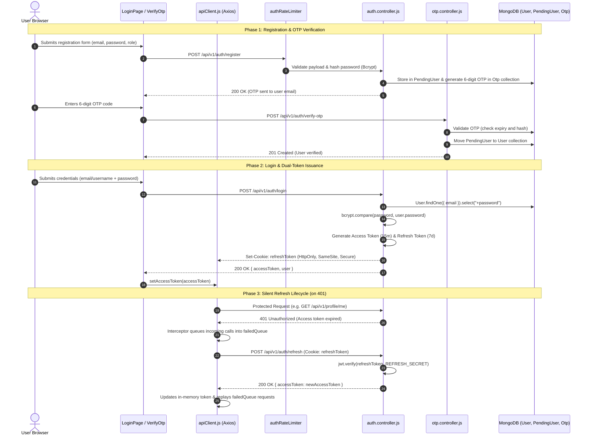

# Feature 02: Authentication & Session Management (JWT, Refresh Token & OTP)

## 1. Executive Summary & Functional Overview
The **Authentication & Session Management** system provides secure, enterprise-grade access control for Merch4Change. It replaces insecure local storage tokens with a **Dual-Token architecture** (short-lived in-memory Access Tokens + long-lived HttpOnly Refresh Tokens stored in secure browser cookies) combined with **Time-based One-Time Password (OTP) verification** during onboarding.

### Key Capabilities
- **Dual-Token JWT Security**: Mitigates Cross-Site Scripting (XSS) and Cross-Site Request Forgery (CSRF).
- **Automated Silent Refresh**: Frontend Axios client automatically detects expired 15-minute access tokens and refreshes them seamlessly without user interruption.
- **Email OTP Verification**: Temporary account staging via `PendingUser` model before activating official account in `User`.
- **Role-Based Access Control (RBAC)**: Enforces permissions across roles: `user`, `brand`, `charity`, and `admin`.

---

## 2. Architecture & Request Lifecycle



---

## 3. Database Models & Schema Specifications

### A. User Model (`code/Backend/src/models/User.js`)
```javascript
const userSchema = new mongoose.Schema(
  {
    userName: { type: String, required: true, unique: true, trim: true },
    email: { type: String, required: true, unique: true, lowercase: true, trim: true },
    password: { type: String, required: true, select: false },
    role: {
      type: String,
      enum: ["user", "brand", "charity", "admin"],
      default: "user",
    },
    accountType: {
      type: String,
      enum: ["individual", "organization"],
      default: "individual",
    },
    coinBalance: { type: Number, default: 0, min: 0 },
    isVerified: { type: Boolean, default: false },
  },
  { timestamps: true }
);
```

### B. OTP Model (`code/Backend/src/models/Otp.js`)
Stores cryptographically hashed verification codes with automatic MongoDB TTL (Time-To-Live) indexing.
```javascript
const otpSchema = new mongoose.Schema(
  {
    email: { type: String, required: true, index: true },
    otpHash: { type: String, required: true },
    expiresAt: { type: Date, required: true, index: { expires: 0 } },
  },
  { timestamps: true }
);
```

---

## 4. API Endpoints Reference

Base URL: `/api/v1/auth`

### 1. Register User
- **Method**: `POST`
- **Route**: `/api/v1/auth/register`
- **Rate Limit**: 20 requests / 15 minutes (`authRateLimiter`)
- **Request Body**:
  ```json
  {
    "userName": "sarah_donor",
    "email": "sarah@example.com",
    "password": "SecurePassword123!",
    "accountType": "individual"
  }
  ```
- **Response (`200 OK`)**:
  ```json
  {
    "success": true,
    "message": "OTP sent to your email. Please verify."
  }
  ```

### 2. Verify OTP
- **Method**: `POST`
- **Route**: `/api/v1/auth/verify-otp`
- **Request Body**:
  ```json
  {
    "email": "sarah@example.com",
    "otp": "481923"
  }
  ```
- **Response (`201 Created`)**:
  ```json
  {
    "success": true,
    "message": "Account verified successfully. Please log in."
  }
  ```

### 3. Login
- **Method**: `POST`
- **Route**: `/api/v1/auth/login`
- **Request Body**:
  ```json
  {
    "identifier": "sarah@example.com",
    "password": "SecurePassword123!"
  }
  ```
- **Response Headers**:
  ```http
  Set-Cookie: refreshToken=<JWT>; HttpOnly; Secure; SameSite=None; Path=/; Max-Age=604800
  ```
- **Response Body (`200 OK`)**:
  ```json
  {
    "success": true,
    "data": {
      "accessToken": "eyJhbGciOiJIUzI1NiIsInR5cCI6...",
      "user": {
        "_id": "664f0f1a2b3c4d5e6f7a8b9c",
        "userName": "sarah_donor",
        "email": "sarah@example.com",
        "role": "user",
        "coinBalance": 0
      }
    }
  }
  ```

### 4. Refresh Token
- **Method**: `POST`
- **Route**: `/api/v1/auth/refresh`
- **Cookie Required**: `refreshToken`
- **Response Body (`200 OK`)**:
  ```json
  {
    "success": true,
    "data": {
      "accessToken": "eyJhbGciOiJIUzI1NiIsInR5cCI6..."
    }
  }
  ```

### 5. Logout
- **Method**: `POST`
- **Route**: `/api/v1/auth/logout`
- **Action**: Clears `refreshToken` cookie and invalidates session.

---

## 5. Frontend Client Integration

### Token Store & Auto-Refresh Interceptor (`code/Frontend/src/api/apiClient.js`)
```javascript
let _accessToken = null;
let isRefreshing = false;
let failedQueue = [];

export const setAccessToken = (token) => { _accessToken = token; };
export const getAccessToken = () => _accessToken;

// Attach Bearer header
apiClient.interceptors.request.use((config) => {
  if (_accessToken) {
    config.headers.Authorization = `Bearer ${_accessToken}`;
  }
  return config;
});

// Intercept 401 and auto-refresh
apiClient.interceptors.response.use(
  (response) => response,
  async (error) => {
    const originalRequest = error.config;
    if (error.response?.status === 401 && !originalRequest._retry) {
      if (isRefreshing) {
        return new Promise((resolve, reject) => {
          failedQueue.push({ resolve, reject });
        }).then((token) => {
          originalRequest.headers.Authorization = `Bearer ${token}`;
          return apiClient(originalRequest);
        });
      }

      originalRequest._retry = true;
      isRefreshing = true;

      try {
        const { data } = await axios.post(
          `${API_BASE}/api/v1/auth/refresh`,
          {},
          { withCredentials: true }
        );
        const newToken = data.data.accessToken;
        setAccessToken(newToken);
        processQueue(null, newToken);
        originalRequest.headers.Authorization = `Bearer ${newToken}`;
        return apiClient(originalRequest);
      } catch (refreshErr) {
        processQueue(refreshErr, null);
        _logoutCallback?.();
        return Promise.reject(refreshErr);
      } finally {
        isRefreshing = false;
      }
    }
    return Promise.reject(error);
  }
);
```

---

## 6. Security Guardrails

1. **HttpOnly Cookie Protection**: `refreshToken` cannot be read by JavaScript `document.cookie`, neutralizing XSS token theft.
2. **SameSite & Secure Attributes**: Ensures cookies are only transmitted over TLS (`Secure`) and prevents cross-site CSRF inclusion.
3. **Bcrypt Salt Rounds**: Passwords are salted with 10 rounds prior to storage.
4. **Rate Limiting**: `authRateLimiter` restricts aggressive brute-force attacks to 20 hits / 15 minutes per IP.
