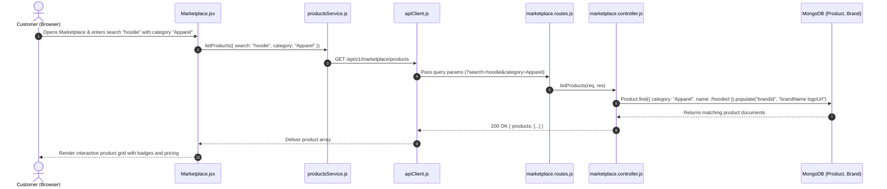

# Feature 03: Marketplace & Product Catalog

## 1. Executive Summary & Functional Overview
The **Marketplace & Product Catalog** is the commercial storefront of Merch4Change. It serves as an open marketplace where verified corporate brands, community startups, and registered individual creators list their merchandise. Every purchase generates in-app Merch Coins for the buyer, driving the philanthropic cycle.

### Key Capabilities
- **Multi-Vendor Architecture**: Supports both corporate brand shops (`Brand` model) and individual creator inventory (`ownerUserId` on `Product`).
- **Discovery & Filtering**: Filter by category (apparel, accessories, collectibles, eco-friendly), price range, search query, brand, and sorting parameters.
- **Dynamic Inventory Management**: Product creation, image association, real-time stock counts, and price updates.
- **Integrated Product Reviews**: Verified customer feedback, rating scores, and product comments.

---

## 2. Architecture & Request Lifecycle



---

## 3. Database Models & Schema Specifications

### A. Product Model (`code/Backend/src/models/Product.js`)
```javascript
const productSchema = new mongoose.Schema(
  {
    name: { type: String, required: true, trim: true },
    description: { type: String, default: "" },
    price: { type: Number, required: true, min: 0 },
    stock: { type: Number, required: true, min: 0, default: 0 },
    category: {
      type: String,
      enum: ["Apparel", "Accessories", "Home", "Collectibles", "Art", "Other"],
      default: "Other",
    },
    images: [{ type: String }],
    brandId: {
      type: mongoose.Schema.Types.ObjectId,
      ref: "Brand",
      default: null,
      index: true,
    },
    ownerUserId: {
      type: mongoose.Schema.Types.ObjectId,
      ref: "User",
      required: true,
      index: true,
    },
    isAuctionItem: { type: Boolean, default: false },
    rating: { type: Number, default: 0, min: 0, max: 5 },
    reviewCount: { type: Number, default: 0 },
  },
  { timestamps: true }
);
```

### B. Brand Model (`code/Backend/src/models/Brand.js`)
```javascript
const brandSchema = new mongoose.Schema(
  {
    brandName: { type: String, required: true, unique: true, trim: true },
    ownerUserId: {
      type: mongoose.Schema.Types.ObjectId,
      ref: "User",
      required: true,
      unique: true,
    },
    logoUrl: { type: String, default: "" },
    bannerUrl: { type: String, default: "" },
    description: { type: String, default: "" },
    website: { type: String, default: "" },
  },
  { timestamps: true }
);
```

---

## 4. API Endpoints Reference

Base URL: `/api/v1/marketplace` and `/api/v1/products`

### 1. List Products (Catalog Discovery)
- **Method**: `GET`
- **Route**: `/api/v1/marketplace/products`
- **Access**: Public
- **Query Parameters**:
  - `category` (optional): Filter by enum category
  - `search` (optional): Partial keyword search
  - `minPrice` / `maxPrice` (optional)
  - `sort` (optional): `price_asc | price_desc | newest`
- **Success Response (`200 OK`)**:
  ```json
  {
    "success": true,
    "statusCode": 200,
    "message": "Products fetched successfully.",
    "data": {
      "products": [
        {
          "_id": "67cb2a98f1234567890abcdef",
          "name": "Eco-Friendly Organic Hoodie",
          "description": "100% recycled cotton hoodie with Merch4Change emblem.",
          "price": 65.00,
          "stock": 42,
          "category": "Apparel",
          "images": ["https://res.cloudinary.com/demo/image/upload/hoodie1.jpg"],
          "brandId": {
            "_id": "664f1a2b3c4d5e6f7a8b9c0d",
            "brandName": "EarthFirst Apparel",
            "logoUrl": "https://res.cloudinary.com/demo/image/upload/earthfirst.png"
          },
          "rating": 4.8,
          "reviewCount": 15
        }
      ]
    }
  }
  ```

### 2. Get Single Product Details
- **Method**: `GET`
- **Route**: `/api/v1/marketplace/products/:productId`
- **Access**: Public

### 3. Create Product
- **Method**: `POST`
- **Route**: `/api/v1/marketplace/products`
- **Access**: Protected (`protect`)
- **Request Body**:
  ```json
  {
    "name": "Ocean Plastic Water Bottle",
    "description": "Insulated stainless steel bottle supporting marine cleanups.",
    "price": 28.00,
    "stock": 100,
    "category": "Accessories",
    "images": ["https://res.cloudinary.com/demo/image/upload/bottle1.jpg"]
  }
  ```
- **Success Response (`201 Created`)**:
  ```json
  {
    "success": true,
    "statusCode": 201,
    "message": "Product created successfully.",
    "data": { "product": { "_id": "67cb2b...", "name": "Ocean Plastic Water Bottle" } }
  }
  ```

### 4. Update Product
- **Method**: `PUT`
- **Route**: `/api/v1/marketplace/products/:productId`
- **Access**: Protected (Requires Product Ownership or Brand Admin)

### 5. Delete Product
- **Method**: `DELETE`
- **Route**: `/api/v1/marketplace/products/:productId`
- **Access**: Protected (Owner Only)

---

## 5. Frontend Client Integration

### Service Layer (`code/Frontend/src/api/productsService.js`)
```javascript
import apiClient from "./apiClient";

export const getProducts = (params = {}) =>
  apiClient.get("/api/v1/marketplace/products", { params });

export const getProductById = (productId) =>
  apiClient.get(`/api/v1/marketplace/products/${productId}`);

export const createProduct = (payload) =>
  apiClient.post("/api/v1/marketplace/products", payload);
```

### Marketplace UI Page (`code/Frontend/src/pages/Marketplace/Marketplace.jsx`)
- Integrates category chips, price sliders, and a search query debouncer.
- Renders responsive product cards displaying product image, brand avatar, price, stock warning (if `stock <= 5`), and "Add to Cart" or "Buy Now" triggers.

---

## 6. Security & Ownership Validation
Before any update or deletion is executed, the backend validates ownership:
```javascript
const ensureProductOwnership = async (product, user) => {
  if (product.ownerUserId && String(product.ownerUserId) === String(user._id)) {
    return;
  }
  const brand = await Brand.findById(product.brandId);
  if (!brand || String(brand.ownerUserId) !== String(user._id)) {
    throw new AppError("You do not have permission to manage this product.", 403, "FORBIDDEN");
  }
};
```
Prevents unauthorized tampering with other vendors' inventory or pricing.
