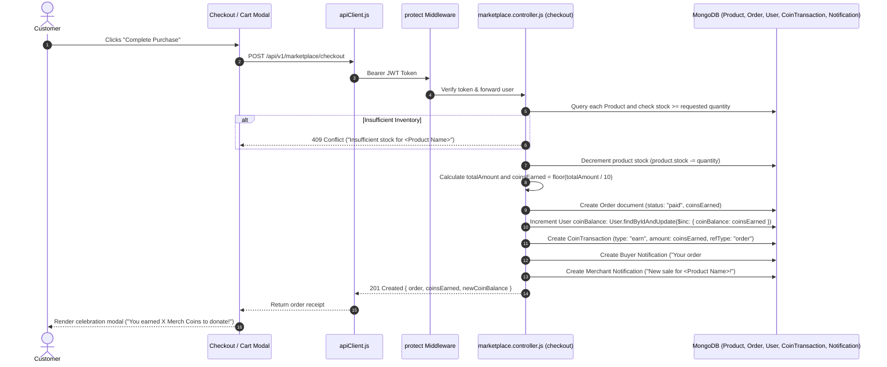

# Feature 04: Order Checkout & Coin Reward Engine

## 1. Executive Summary & Functional Overview
The **Order Checkout & Coin Reward Engine** powers commercial purchases in Merch4Change and bridges commerce with charity. When a customer checks out merchandise, the platform verifies real-time inventory, executes order fulfillment, decrements stock, and programmatically awards **Merch Coins** into the customer's wallet ($1 \text{ coin per } \$10 \text{ spent}$).

### Core Capabilities
- **Multi-Item Order Processing**: Handles single-item and multi-vendor shopping carts in a single checkout call.
- **Inventory Concurrency Protection**: Validates current item stock against requested quantities before billing.
- **Dynamic Coin Reward Calculation**: Automatically credits $\lfloor \text{Total USD} / 10 \rfloor$ coins to the buyer.
- **Audit-Proof Coin Accounting**: Logs credit transactions to `CoinTransaction` with references to the corresponding `Order._id`.
- **Multi-Party Event Notifications**: Dispatches instant purchase confirmations to the buyer and sale alerts to the respective merchants.

---

## 2. Architecture & Request Lifecycle



---

## 3. Database Models & Schema Specifications

### A. Order Model (`code/Backend/src/models/Order.js`)
```javascript
const orderItemSchema = new mongoose.Schema(
  {
    productId: {
      type: mongoose.Schema.Types.ObjectId,
      ref: "Product",
      required: true,
    },
    titleSnapshot: { type: String, required: true },
    quantity: { type: Number, required: true, min: 1 },
    unitPrice: { type: Number, required: true, min: 0 },
  },
  { _id: false }
);

const orderSchema = new mongoose.Schema(
  {
    userId: {
      type: mongoose.Schema.Types.ObjectId,
      ref: "User",
      required: true,
      index: true,
    },
    items: [orderItemSchema],
    currency: { type: String, default: "USD" },
    totalAmount: { type: Number, required: true, min: 0 },
    status: {
      type: String,
      enum: ["pending", "paid", "shipped", "delivered", "cancelled"],
      default: "paid",
    },
    coinsEarned: { type: Number, default: 0, min: 0 },
  },
  { timestamps: true }
);
```

### B. Coin Reward Formula
$$\text{coinsEarned} = \left\lfloor \frac{\text{totalAmount}}{10} \right\rfloor$$

*Example*: A cart totaling **\$89.50** grants **8 Merch Coins** directly to the buyer's balance.

---

## 4. API Endpoints Reference

Base URL: `/api/v1/marketplace/checkout`

### 1. Execute Order Checkout
- **Method**: `POST`
- **Route**: `/api/v1/marketplace/checkout`
- **Access**: Protected (`protect`)
- **Headers**:
  ```http
  Authorization: Bearer <access_token>
  Content-Type: application/json
  ```
- **Request Body**:
  ```json
  {
    "items": [
      {
        "productId": "67cb2a98f1234567890abcdef",
        "quantity": 2
      },
      {
        "productId": "67cb2b12f1234567890fedcba",
        "quantity": 1
      }
    ]
  }
  ```
- **Success Response (`201 Created`)**:
  ```json
  {
    "success": true,
    "statusCode": 201,
    "message": "Checkout completed successfully.",
    "data": {
      "order": {
        "_id": "67cb3a1198f7e2a440112345",
        "userId": "664f0f1a2b3c4d5e6f7a8b9c",
        "items": [
          {
            "productId": "67cb2a98f1234567890abcdef",
            "titleSnapshot": "Eco-Friendly Organic Hoodie",
            "quantity": 2,
            "unitPrice": 65.00
          },
          {
            "productId": "67cb2b12f1234567890fedcba",
            "titleSnapshot": "Stainless Steel Water Bottle",
            "quantity": 1,
            "unitPrice": 28.00
          }
        ],
        "totalAmount": 158.00,
        "currency": "USD",
        "status": "paid",
        "coinsEarned": 15,
        "createdAt": "2026-09-06T10:15:00.000Z"
      },
      "coinsEarned": 15
    }
  }
  ```
- **Error Responses**:
  - `404 Not Found`: `{"success": false, "errorCode": "PRODUCT_NOT_FOUND", "message": "Product not found for id ..."}`
  - `409 Conflict`: `{"success": false, "errorCode": "INSUFFICIENT_STOCK", "message": "Insufficient stock for Eco-Friendly Organic Hoodie."}`

---

## 5. Frontend Client Integration

### API Service Call
```javascript
export const checkoutCart = async (cartItems) => {
  const payload = {
    items: cartItems.map((item) => ({
      productId: item.id || item._id,
      quantity: item.quantity,
    })),
  };
  return await apiClient.post("/api/v1/marketplace/checkout", payload);
};
```

### Post-Checkout State Synchronization
1. Upon `201 Created`, the frontend updates the client-side cart (clearing purchased items).
2. The user's header coin pill automatically increments by `coinsEarned`.
3. A success banner invites the user: *"You just earned 15 Merch Coins! Want to donate them to a clean water project now?"* with a direct link to `/donate`.

---

## 6. Security, Concurrency & Data Integrity

1. **Price Snapshotting**: Unit prices are taken directly from the database record during execution—never trusted from client request payloads.
2. **Stock Protection**: Decrement only occurs if `product.stock >= quantity`.
3. **Atomic User Balance Credit**:
   ```javascript
   await User.findByIdAndUpdate(req.user._id, {
     $inc: { coinBalance: coinsEarned },
   });
   ```
4. **Transaction Traceability**: The resulting `CoinTransaction` stores `refType: "order"` and `refId: order._id`, ensuring complete auditability for system administrators.
