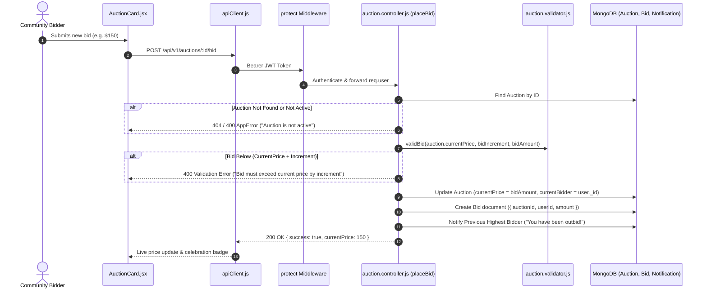

# Feature 05: Auctions & Real-Time Bidding System

## 1. Executive Summary & Functional Overview
The **Auctions & Real-Time Bidding System** enables exclusive drops of rare, limited-edition merchandise, celebrity collectibles, and charity-driven items. Rather than fixed-price sales, brands and individuals can initiate time-delimited competitive auctions, allowing community members to place escalating bids.

### Key Capabilities
- **Scheduled & Active Lifecycles**: Automatic status assignment (`scheduled` vs. `active`) based on real-time timestamps.
- **Strict Bid Validations**: Enforces start price baselines and minimum bid increment rules.
- **Bid History & Audit**: Every bid is permanently logged with bidder identity, amount, and timestamp.
- **Top Bidder Tracking**: Real-time assignment of the current highest bidder.

---

## 2. Architecture & Request Lifecycle



---

## 3. Database Models & Schema Specifications

### A. Auction Model (`code/Backend/src/models/Auction.js`)
```javascript
const auctionSchema = new mongoose.Schema(
  {
    productId: {
      type: mongoose.Schema.Types.ObjectId,
      ref: "Product",
      required: true,
      index: true,
    },
    startPrice: { type: Number, required: true, min: 0 },
    currentPrice: { type: Number, required: true, min: 0 },
    currentBidder: {
      type: mongoose.Schema.Types.ObjectId,
      ref: "User",
      default: null,
    },
    bidIncrement: { type: Number, default: 5, min: 1 },
    startTime: { type: Date, required: true },
    endTime: { type: Date, required: true },
    status: {
      type: String,
      enum: ["scheduled", "active", "ended", "cancelled"],
      default: "scheduled",
      index: true,
    },
    createdBy: {
      type: mongoose.Schema.Types.ObjectId,
      ref: "User",
      required: true,
    },
  },
  { timestamps: true }
);
```

### B. Bid Model (`code/Backend/src/models/Bid.js`)
```javascript
const bidSchema = new mongoose.Schema(
  {
    auctionId: {
      type: mongoose.Schema.Types.ObjectId,
      ref: "Auction",
      required: true,
      index: true,
    },
    userId: {
      type: mongoose.Schema.Types.ObjectId,
      ref: "User",
      required: true,
    },
    amount: { type: Number, required: true, min: 1 },
  },
  { timestamps: true }
);
```

---

## 4. API Endpoints Reference

Base URL: `/api/v1/auctions`

### 1. Create Auction
- **Method**: `POST`
- **Route**: `/api/v1/auctions`
- **Access**: Protected (`protect`)
- **Request Body**:
  ```json
  {
    "productId": "67cb2a98f1234567890abcdef",
    "startPrice": 50.00,
    "bidIncrement": 5.00,
    "startTime": "2026-09-06T12:00:00Z",
    "endTime": "2026-09-10T12:00:00Z"
  }
  ```
- **Success Response (`201 Created`)**:
  ```json
  {
    "success": true,
    "auction": {
      "_id": "67cb4012ab98f12345678901",
      "productId": "67cb2a98f1234567890abcdef",
      "startPrice": 50,
      "currentPrice": 50,
      "status": "scheduled"
    }
  }
  ```

### 2. Place Bid
- **Method**: `POST`
- **Route**: `/api/v1/auctions/:id/bid`
- **Access**: Protected (`protect`)
- **Request Body**:
  ```json
  {
    "amount": 75.00
  }
  ```
- **Success Response (`200 OK`)**:
  ```json
  {
    "success": true,
    "message": "Bid placed successfully.",
    "currentPrice": 75.00
  }
  ```

### 3. List Active Auctions
- **Method**: `GET`
- **Route**: `/api/v1/auctions`
- **Access**: Public

---

## 5. Security & Time Validation Rules
Before accepting an auction or bid, [`auction.validator.js`](file:///home/malith-sandanayake/projects/2yp/e23-co2060-Merch4Change/code/Backend/src/validators/auction.validator.js) enforces:
1. `endTime > startTime` and `endTime > Date.now()`.
2. Bids can only be placed when `auction.status === "active"`.
3. `bidAmount >= currentPrice + bidIncrement`.
