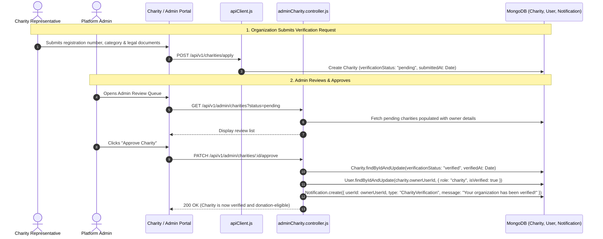

# Feature 06: Charities & NGO Verification Workflow

## 1. Executive Summary & Functional Overview
To protect donors from fraudulent campaigns, Merch4Change enforces a strict **Trust & Verification Architecture**. While any registered non-profit organization can create an organization profile, they cannot receive public donations or create fundraising campaigns until vetted and approved by a Merch4Change Administrator.

### Key Capabilities
- **Organization Onboarding**: Non-profit submission with registration numbers, official documents, cause categorization, and mission statements.
- **Admin Review Queue**: Dedicated admin portal to inspect legal documents and verification requests.
- **Approve / Reject Lifecycle**: Automated notification dispatches, status transitions, and user role elevation (`role: "charity"`, `isVerified: true`).
- **Verified Public Directory**: Public discovery of verified charities categorized by focus area (Health, Education, Environment, Animal Welfare, Disaster Relief).

---

## 2. Architecture & Request Lifecycle



---

## 3. Database Models & Schema Specifications

### Charity Model (`code/Backend/src/models/Charity.js`)
```javascript
const charitySchema = new mongoose.Schema(
  {
    ownerUserId: {
      type: mongoose.Schema.Types.ObjectId,
      ref: "User",
      required: true,
      unique: true,
      index: true,
    },
    publicName: { type: String, required: true, trim: true },
    description: { type: String, default: "" },
    category: {
      type: String,
      enum: ["Health", "Education", "Environment", "Animal Welfare", "Disaster Relief", "Community", "Other"],
      default: "Community",
      index: true,
    },
    registrationNumber: { type: String, default: "" },
    verificationStatus: {
      type: String,
      enum: ["pending", "verified", "rejected"],
      default: "pending",
      index: true,
    },
    logoUrl: { type: String, default: "" },
    website: { type: String, default: "" },
    verifiedAt: { type: Date, default: null },
    verifiedByUserId: {
      type: mongoose.Schema.Types.ObjectId,
      ref: "User",
      default: null,
    },
    rejectionReason: { type: String, default: "" },
  },
  { timestamps: true }
);
```

---

## 4. API Endpoints Reference

Base URL: `/api/v1/charities` and `/api/v1/admin/charities`

### 1. List Public Verified Charities
- **Method**: `GET`
- **Route**: `/api/v1/charities`
- **Access**: Public
- **Query Filter**: `category` (optional)
- **Response (`200 OK`)**:
  ```json
  {
    "success": true,
    "data": {
      "charities": [
        {
          "_id": "664f1a2b3c4d5e6f7a8b9c0d",
          "publicName": "Rainforest Guardians",
          "category": "Environment",
          "logoUrl": "https://res.cloudinary.com/demo/image/upload/rainforest.png",
          "website": "https://rainforestguardians.org",
          "verificationStatus": "verified"
        }
      ]
    }
  }
  ```

### 2. Admin: Approve Charity
- **Method**: `PATCH`
- **Route**: `/api/v1/admin/charities/:id/approve`
- **Access**: Admin Protected (`protect`, `restrictTo("admin")`)
- **Response (`200 OK`)**:
  ```json
  {
    "success": true,
    "message": "Charity approved successfully.",
    "data": {
      "charity": {
        "_id": "664f1a2b3c4d5e6f7a8b9c0d",
        "verificationStatus": "verified",
        "verifiedAt": "2026-09-06T10:20:00.000Z"
      }
    }
  }
  ```

### 3. Admin: Reject Charity
- **Method**: `PATCH`
- **Route**: `/api/v1/admin/charities/:id/reject`
- **Access**: Admin Protected (`protect`, `restrictTo("admin")`)
- **Request Body**:
  ```json
  { "rejectionReason": "Unable to verify government registration certificate." }
  ```

---

## 5. Security & Permission Enforcement
1. `restrictTo("admin")`: Enforces that only accounts with `role: "admin"` can mutate charity verification states.
2. Verified charities receive an elevated status badge in frontend UI views, establishing immediate visual trust for donors.
