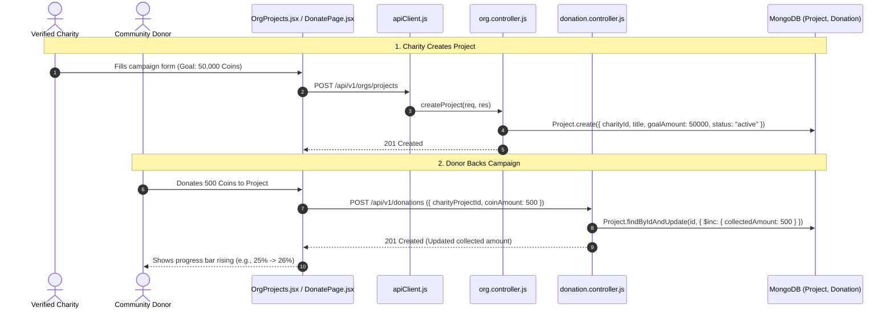

# Feature 07: Charitable Projects & Fundraising Campaigns

## 1. Executive Summary & Functional Overview
The **Charitable Projects & Fundraising Campaigns** module enables verified non-profit organizations to create targeted, measurable initiatives (e.g., building rural classrooms, funding surgeries, planting trees) with designated financial/coin goals. Donors can pledge coins directly to these specific projects rather than general funds, viewing live progress bars.

### Key Capabilities
- **Campaign Creation**: Verified charities define project titles, descriptions, target goals, timelines, and category tags.
- **Dynamic Funding Progress**: Automatically updates `collectedAmount` and computes completion percentages whenever a coin donation is executed.
- **Campaign Status Engine**: Manages project lifecycle states: `active`, `completed`, and `paused`.
- **Donor Attribution**: Records user contributions per campaign, empowering personal impact tracking on donor dashboards.

---

## 2. Architecture & Request Lifecycle



---

## 3. Database Models & Schema Specifications

### Project Model (`code/Backend/src/models/Project.js`)
```javascript
const projectSchema = new mongoose.Schema(
  {
    charityId: {
      type: mongoose.Schema.Types.ObjectId,
      ref: "Charity",
      required: true,
      index: true,
    },
    title: { type: String, required: true, trim: true },
    description: { type: String, default: "" },
    goalAmount: { type: Number, required: true, min: 1 },
    collectedAmount: { type: Number, default: 0, min: 0 },
    images: [{ type: String }],
    status: {
      type: String,
      enum: ["active", "completed", "paused"],
      default: "active",
      index: true,
    },
    startDate: { type: Date, default: Date.now },
    endDate: { type: Date, default: null },
  },
  { timestamps: true }
);
```

---

## 4. API Endpoints Reference

Base URL: `/api/v1/orgs/projects` and `/api/v1/donations/projects`

### 1. Create Charity Project
- **Method**: `POST`
- **Route**: `/api/v1/orgs/projects`
- **Access**: Protected (Requires Verified Charity Role)
- **Request Body**:
  ```json
  {
    "title": "Clean Water Wells for Northern Province",
    "description": "Drilling 5 solar-powered boreholes to provide clean drinking water to over 3,000 families.",
    "goalAmount": 75000,
    "images": ["https://res.cloudinary.com/demo/image/upload/well1.jpg"]
  }
  ```
- **Response (`201 Created`)**:
  ```json
  {
    "success": true,
    "data": {
      "project": {
        "_id": "67cb4510ab98f12345678901",
        "title": "Clean Water Wells for Northern Province",
        "goalAmount": 75000,
        "collectedAmount": 0,
        "status": "active"
      }
    }
  }
  ```

### 2. List Public Projects
- **Method**: `GET`
- **Route**: `/api/v1/donations/projects`
- **Access**: Public
- **Query Params**: `charityId` (optional), `status` (default: `active`)

---

## 5. Funding Percentage Computation
Frontend components compute live progress dynamically:
$$\text{Progress \%} = \min\left(100, \left\lfloor \frac{\text{collectedAmount}}{\text{goalAmount}} \times 100 \right\rfloor\right)$$
When $\text{collectedAmount} \ge \text{goalAmount}$, the project is highlighted with a "Goal Met!" banner.
