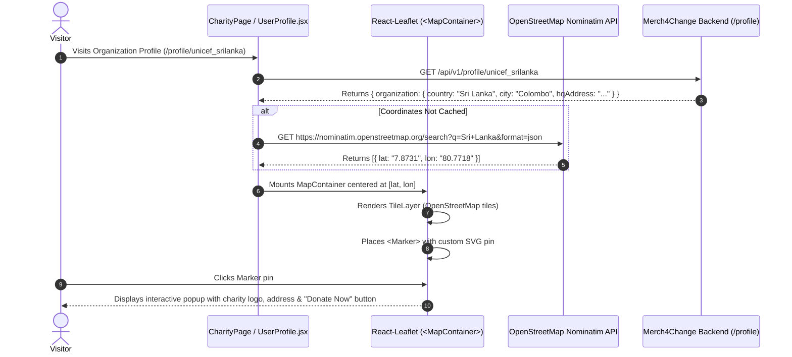

# Feature 08: Organization HQ Geolocation & Interactive Mapping

## 1. Executive Summary & Functional Overview
The **Organization HQ Geolocation & Interactive Mapping** feature brings geographic transparency to non-profits and corporate brands on Merch4Change. Utilizing **React-Leaflet** and **OpenStreetMap**, the platform converts registered organizational country and address data into interactive geographic map pins, allowing donors to discover where charities operate globally.

### Key Capabilities
- **OpenStreetMap & Leaflet Integration**: Lightweight, open-source dynamic mapping with smooth panning and zoom controls.
- **Dynamic Geocoding**: Resolves registered organization country and regional metadata into precise geographic latitude/longitude coordinates via OpenStreetMap Geocoding APIs.
- **Interactive Organization Popups**: Clicking a map marker presents organizational branding, headquarters city/country, verification badge, and direct link to their donation profile.
- **Zero Heavy Third-Party Dependencies**: No paid Google Maps API keys required, avoiding API rate-limiting paywalls.

---

## 2. Architecture & Data Flow



---

## 3. Implementation Details

### React-Leaflet Component Integration (`code/Frontend/src/pages/UserProfile/UserProfile.jsx`)
```jsx
import React, { useState, useEffect } from "react";
import { MapContainer, TileLayer, Marker, Popup } from "react-leaflet";
import "leaflet/dist/leaflet.css";
import L from "leaflet";

// Custom branded map pin
const customPinIcon = new L.Icon({
  iconUrl: "/assets/icons/map-pin.svg",
  iconSize: [36, 36],
  iconAnchor: [18, 36],
  popupAnchor: [0, -32],
});

export const OrgHqMap = ({ country, organizationName, city }) => {
  const [coords, setCoords] = useState([7.8731, 80.7718]); // Default fallback
  const [loading, setLoading] = useState(true);

  useEffect(() => {
    if (!country) return;
    const fetchGeocode = async () => {
      try {
        const query = encodeURIComponent(`${city ? city + ", " : ""}${country}`);
        const res = await fetch(`https://nominatim.openstreetmap.org/search?q=${query}&format=json&limit=1`);
        const data = await res.json();
        if (data && data[0]) {
          setCoords([parseFloat(data[0].lat), parseFloat(data[0].lon)]);
        }
      } catch (err) {
        console.warn("Geocoding failed, using fallback:", err);
      } finally {
        setLoading(false);
      }
    };
    fetchGeocode();
  }, [country, city]);

  return (
    <div className="org-map-wrapper">
      <MapContainer center={coords} zoom={6} scrollWheelZoom={false} className="leaflet-container">
        <TileLayer
          attribution='&copy; <a href="https://www.openstreetmap.org/copyright">OpenStreetMap</a> contributors'
          url="https://{s}.tile.openstreetmap.org/{z}/{x}/{y}.png"
        />
        <Marker position={coords} icon={customPinIcon}>
          <Popup>
            <div className="map-popup-card">
              <h4>{organizationName}</h4>
              <p>📍 {city ? `${city}, ` : ""}{country}</p>
            </div>
          </Popup>
        </Marker>
      </MapContainer>
    </div>
  );
};
```

---

## 4. Security & Performance Guidelines
1. **Nominatim Request Throttling**: OSM Nominatim requires user-agent identification and requests should not exceed 1 request per second. The client caches resolved coordinates to minimize calls.
2. **Fallback Geolocation**: In the event of network disruption or unknown countries, graceful coordinates prevent map crashes.
