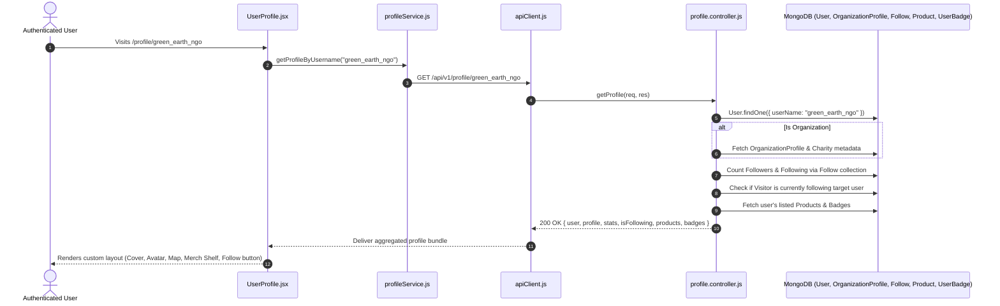

# Feature 09: Unified Profiles & Social Follow System

## 1. Executive Summary & Functional Overview
The **Unified Profiles & Social Follow System** provides a polymorphic identity layer for Merch4Change. Whether a user is an individual donor, an influencer, a corporate brand, or a charity, they share a unified route (`/profile/:username`), rendered through a responsive profile interface featuring glassmorphic cards, social stats, activity histories, earned badges, and personal product shelves.

### Key Capabilities
- **Polymorphic Profile Routing**: Automatically detects whether the target username is an Individual or an Organization, dynamically rendering the appropriate modules (e.g. Org HQ Maps vs. Donor Badges).
- **Follow & Unfollow System**: Unidirectional follow relationships tracked in a dedicated `Follow` collection with follower/following counters.
- **Dynamic User Product Shelves**: Enables individual creators and brands to list their merchandise directly from their profile via an interactive modal.
- **Badge & Reputation Showcase**: Visual display of earned donor badges and milestones.

---

## 2. Architecture & Request Lifecycle



---

## 3. Database Models & Schema Specifications

### A. Follow Model (`code/Backend/src/models/Follow.js`)
```javascript
const followSchema = new mongoose.Schema(
  {
    followerUserId: {
      type: mongoose.Schema.Types.ObjectId,
      ref: "User",
      required: true,
      index: true,
    },
    followingUserId: {
      type: mongoose.Schema.Types.ObjectId,
      ref: "User",
      required: true,
      index: true,
    },
  },
  { timestamps: true }
);

// Compound index prevents duplicate follows
followSchema.index({ followerUserId: 1, followingUserId: 1 }, { unique: true });
```

### B. OrganizationProfile Model (`code/Backend/src/models/OrganizationProfile.js`)
```javascript
const organizationProfileSchema = new mongoose.Schema(
  {
    userId: {
      type: mongoose.Schema.Types.ObjectId,
      ref: "User",
      required: true,
      unique: true,
    },
    organizationName: { type: String, required: true },
    tagline: { type: String, default: "" },
    country: { type: String, default: "" },
    city: { type: String, default: "" },
    hqAddress: { type: String, default: "" },
    missionStatement: { type: String, default: "" },
  },
  { timestamps: true }
);
```

---

## 4. API Endpoints Reference

Base URL: `/api/v1/profile`

### 1. Get Public Profile by Username
- **Method**: `GET`
- **Route**: `/api/v1/profile/:username`
- **Access**: Public (Optional Auth detects `isFollowing`)
- **Success Response (`200 OK`)**:
  ```json
  {
    "success": true,
    "data": {
      "user": {
        "_id": "664f0f1a2b3c4d5e6f7a8b9c",
        "userName": "sarah_donor",
        "firstName": "Sarah",
        "lastName": "Jenkins",
        "accountType": "individual",
        "avatarUrl": "https://res.cloudinary.com/demo/image/upload/avatar.png",
        "bio": "Passionate about marine conservation."
      },
      "stats": {
        "followersCount": 142,
        "followingCount": 89,
        "donationsCount": 14,
        "productsCount": 3
      },
      "isFollowing": false
    }
  }
  ```

### 2. Follow / Unfollow User
- **Method**: `POST`
- **Route**: `/api/v1/profile/:userId/follow`
- **Access**: Protected (`protect`)
- **Description**: Toggles follow status atomically. If already following, deletes follow record; if not following, creates record and dispatches notification.
- **Success Response (`200 OK`)**:
  ```json
  {
    "success": true,
    "message": "User followed successfully.",
    "isFollowing": true
  }
  ```

### 3. Update My Profile
- **Method**: `PUT`
- **Route**: `/api/v1/profile/me`
- **Access**: Protected (`protect`)
- **Request Body**:
  ```json
  {
    "firstName": "Sarah",
    "bio": "Ocean activist | Merch collector",
    "avatarUrl": "https://res.cloudinary.com/demo/image/upload/avatar_v2.png"
  }
  ```

---

## 5. Security & Validation Safeguards
1. **Self-Follow Prevention**: The backend verifies `req.user._id.toString() !== targetUserId.toString()`.
2. **Compound Unique Indexing**: MongoDB compound index `{ followerUserId: 1, followingUserId: 1 }` prevents concurrent double-follow race conditions.
