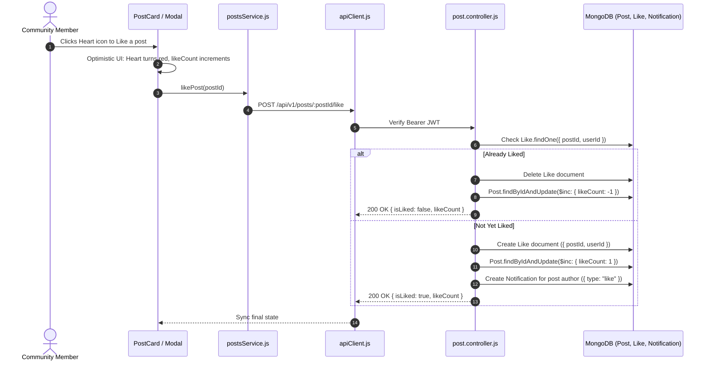

# Feature 10: Community Posts, Interactions & Comments

## 1. Executive Summary & Functional Overview
The **Community Posts, Interactions & Comments** system provides the social engagement engine in Merch4Change. It allows brands, charities, and community members to share real-time updates, showcase charity milestones, announce product drops, and engage through animated **Likes** and **Threaded Comments**.

### Key Capabilities
- **Rich Media Posts**: Text captions, high-resolution media attachments, charity project links, and brand tags.
- **Atomic Like Toggling**: Single-click toggle between liked and unliked states with animated heart feedback and optimistic UI updates.
- **Comment System**: Real-time comment submission and display with commenter avatars and timestamps.
- **Notification Triggers**: Instant in-app notification sent to the post author when their content receives a new like or comment.

---

## 2. Architecture & Request Lifecycle



---

## 3. Database Models & Schema Specifications

### A. Post Model (`code/Backend/src/models/Post.js`)
```javascript
const postSchema = new mongoose.Schema(
  {
    authorUserId: {
      type: mongoose.Schema.Types.ObjectId,
      ref: "User",
      required: true,
      index: true,
    },
    caption: { type: String, default: "" },
    images: [{ type: String }],
    likeCount: { type: Number, default: 0, min: 0 },
    commentCount: { type: Number, default: 0, min: 0 },
    comments: [
      {
        userId: { type: mongoose.Schema.Types.ObjectId, ref: "User", required: true },
        text: { type: String, required: true, trim: true },
        createdAt: { type: Date, default: Date.now },
      },
    ],
  },
  { timestamps: true }
);
```

### B. Like Model (`code/Backend/src/models/Like.js`)
```javascript
const likeSchema = new mongoose.Schema(
  {
    postId: {
      type: mongoose.Schema.Types.ObjectId,
      ref: "Post",
      required: true,
      index: true,
    },
    userId: {
      type: mongoose.Schema.Types.ObjectId,
      ref: "User",
      required: true,
      index: true,
    },
  },
  { timestamps: true }
);

likeSchema.index({ postId: 1, userId: 1 }, { unique: true });
```

---

## 4. API Endpoints Reference

Base URL: `/api/v1/posts`

### 1. Like / Unlike Post
- **Method**: `POST`
- **Route**: `/api/v1/posts/:postId/like`
- **Access**: Protected (`protect`)
- **Response (`200 OK`)**:
  ```json
  {
    "success": true,
    "message": "Post liked successfully.",
    "data": { "isLiked": true, "likeCount": 42 }
  }
  ```

### 2. Comment on Post
- **Method**: `POST`
- **Route**: `/api/v1/posts/:postId/comment`
- **Access**: Protected (`protect`)
- **Request Body**:
  ```json
  { "text": "Amazing initiative! So glad to see the impact in person." }
  ```
- **Response (`201 Created`)**:
  ```json
  {
    "success": true,
    "message": "Comment added.",
    "data": {
      "comment": {
        "text": "Amazing initiative! So glad to see the impact in person.",
        "userId": "664f0f1a2b3c4d5e6f7a8b9c",
        "createdAt": "2026-09-06T10:30:00.000Z"
      }
    }
  }
  ```

---

## 5. Concurrency & Optimistic State Handling
- Compound unique index on `{ postId: 1, userId: 1 }` prevents double-like duplicates.
- Frontend applies instant optimistic color change on the heart icon. If the server request fails, it rolls back state and displays a discreet toast notification.
