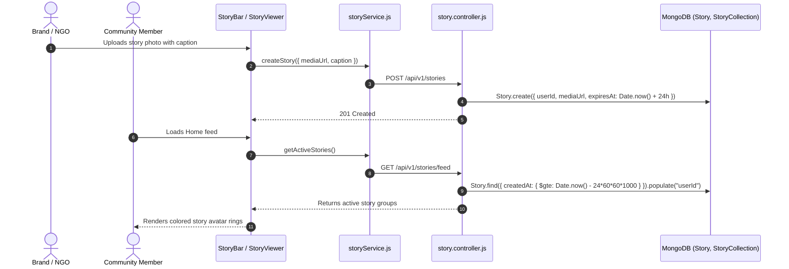

# Feature 11: Ephemeral Stories & Story Highlights

## 1. Executive Summary & Functional Overview
The **Ephemeral Stories & Story Highlights** feature gives brands, creators, and charitable organizations a fast-paced, visual medium to post real-time field updates, temporary product drop alerts, or behind-the-scenes moments. Stories expire automatically after 24 hours, while key memories can be organized into permanent **Story Collections / Highlights** displayed on user profiles.

### Key Capabilities
- **24-Hour Auto-Expiration**: Stories expire via TTL query filters (`createdAt >= 24 hours ago`).
- **Interactive Story Reel**: Horizontal avatar ring carousel on the Home Feed with unviewed gradient borders.
- **Story Highlights / Collections**: Curate past stories into categorized profile circles (e.g. "Beach Cleanup 2026", "Drop #1").
- **View Tracking**: Measures viewer reach and donor engagement.

---

## 2. Architecture & Data Flow



---

## 3. Database Models & Schema Specifications

### A. Story Model (`code/Backend/src/models/Story.js`)
```javascript
const storySchema = new mongoose.Schema(
  {
    userId: {
      type: mongoose.Schema.Types.ObjectId,
      ref: "User",
      required: true,
      index: true,
    },
    mediaUrl: { type: String, required: true },
    caption: { type: String, default: "" },
    expiresAt: {
      type: Date,
      default: () => new Date(Date.now() + 24 * 60 * 60 * 1000),
      index: { expires: 0 },
    },
  },
  { timestamps: true }
);
```

### B. StoryCollection Model (`code/Backend/src/models/StoryCollection.js`)
```javascript
const storyCollectionSchema = new mongoose.Schema(
  {
    userId: {
      type: mongoose.Schema.Types.ObjectId,
      ref: "User",
      required: true,
      index: true,
    },
    title: { type: String, required: true, trim: true },
    coverImageUrl: { type: String, default: "" },
    stories: [{ type: mongoose.Schema.Types.ObjectId, ref: "Story" }],
  },
  { timestamps: true }
);
```

---

## 4. API Endpoints Reference

Base URL: `/api/v1/stories` and `/api/v1/collections`

### 1. Create Story
- **Method**: `POST`
- **Route**: `/api/v1/stories`
- **Access**: Protected (`protect`)
- **Request Body**:
  ```json
  {
    "mediaUrl": "https://res.cloudinary.com/demo/image/upload/story1.jpg",
    "caption": "Arrived at the school site in Jaffna!"
  }
  ```
- **Response (`201 Created`)**:
  ```json
  { "success": true, "data": { "story": { "_id": "67cb50...", "mediaUrl": "..." } } }
  ```

### 2. Get Feed Stories
- **Method**: `GET`
- **Route**: `/api/v1/stories/feed`
- **Access**: Protected (`protect`)

### 3. Create Story Collection / Highlight
- **Method**: `POST`
- **Route**: `/api/v1/collections`
- **Access**: Protected (`protect`)
- **Request Body**:
  ```json
  {
    "title": "Cleanups 2026",
    "coverImageUrl": "https://res.cloudinary.com/demo/image/upload/cover.jpg",
    "storyIds": ["67cb50..."]
  }
  ```
