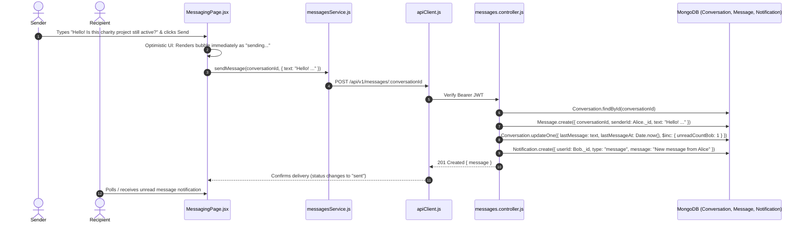

# Feature 12: Direct Messaging System

## 1. Executive Summary & Functional Overview
The **Direct Messaging System** enables private, peer-to-peer text communication between community donors, vendor brands, and non-profit organizations. It allows users to inquire about product sizing or drop dates, permits donors to coordinate directly with charities, and facilitates collaboration across community initiatives.

### Key Capabilities
- **Conversation Threading**: Deterministic `participantKey` generation ensures that only one distinct conversation thread exists between any pair of users.
- **Unread Message Counters**: Real-time tracking of unread incoming messages per conversation.
- **Dynamic Identity Styling**: Hashed consistent avatar color palettes (`getColorForUser`) and display names for organizations and individuals.
- **In-App Message Notifications**: Automated dispatch of notification alerts when a recipient is outside the active chat room.

---

## 2. Architecture & Request Lifecycle



---

## 3. Database Models & Schema Specifications

### A. Conversation Model (`code/Backend/src/models/Conversation.js`)
```javascript
const conversationSchema = new mongoose.Schema(
  {
    participantIds: [
      {
        type: mongoose.Schema.Types.ObjectId,
        ref: "User",
        required: true,
      },
    ],
    participantKey: {
      type: String,
      required: true,
      unique: true,
      index: true,
    },
    lastMessage: { type: String, default: "" },
    lastMessageAt: { type: Date, default: Date.now },
  },
  { timestamps: true }
);
```

### B. Message Model (`code/Backend/src/models/Message.js`)
```javascript
const messageSchema = new mongoose.Schema(
  {
    conversationId: {
      type: mongoose.Schema.Types.ObjectId,
      ref: "Conversation",
      required: true,
      index: true,
    },
    senderId: {
      type: mongoose.Schema.Types.ObjectId,
      ref: "User",
      required: true,
      index: true,
    },
    text: { type: String, required: true, trim: true },
    isRead: { type: Boolean, default: false },
  },
  { timestamps: true }
);
```

---

## 4. API Endpoints Reference

Base URL: `/api/v1/messages`

### 1. List My Conversations
- **Method**: `GET`
- **Route**: `/api/v1/messages/conversations`
- **Access**: Protected (`protect`)
- **Response (`200 OK`)**:
  ```json
  {
    "success": true,
    "data": {
      "conversations": [
        {
          "_id": "67cb5a1098f1234567890abc",
          "otherParticipant": {
            "_id": "664f1a2b3c4d5e6f7a8b9c0d",
            "displayName": "EarthCare Foundation",
            "avatarUrl": "...",
            "contactType": "org"
          },
          "lastMessage": "Thank you for the 500 coin donation!",
          "lastMessageAt": "2026-09-06T10:35:00.000Z",
          "unreadCount": 2
        }
      ]
    }
  }
  ```

### 2. Send Message
- **Method**: `POST`
- **Route**: `/api/v1/messages/conversations/:id`
- **Access**: Protected (`protect`)
- **Request Body**:
  ```json
  { "text": "Are you planning another tree planting event next weekend?" }
  ```
- **Response (`201 Created`)**:
  ```json
  {
    "success": true,
    "data": {
      "message": {
        "_id": "67cb5b2098f1234567890def",
        "conversationId": "67cb5a1098f1234567890abc",
        "senderId": "664f0f1a2b3c4d5e6f7a8b9c",
        "text": "Are you planning another tree planting event next weekend?",
        "createdAt": "2026-09-06T10:40:00.000Z"
      }
    }
  }
  ```

---

## 5. Security & Concurrency Controls
- **Thread Normalization**: `participantKey` is built by sorting string IDs (`[id1, id2].sort().join(":")`), strictly preventing duplicate split conversations between the same two users.
- **Authorization Guard**: The message controller explicitly verifies that `req.user._id` belongs to `conversation.participantIds` before granting read or write access to messages.
