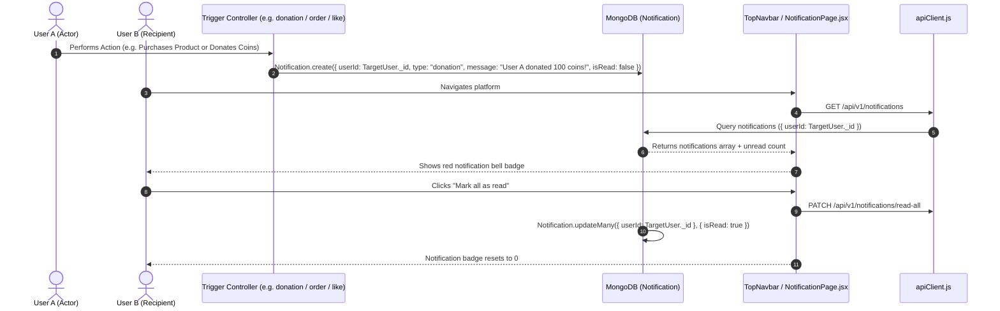

# Feature 13: In-App Notifications System

## 1. Executive Summary & Functional Overview
The **In-App Notifications System** serves as the real-time activity dispatch hub for Merch4Change. It tracks platform milestones, commercial purchases, philanthropic contributions, and social interactions, alerting users via a notification center and navbar badge counter.

### Event Triggers
- **Order Confirmations**: Buyers receive receipts; sellers receive order fulfillment alerts.
- **Philanthropy Alerts**: Non-profits are notified of coin pledges; donors receive receipt confirmations.
- **Social Engagement**: Authors receive notifications when community members like or comment on their posts.
- **Verification Status**: Organizations receive real-time notices when approved or reviewed by admins.
- **Auctions**: Bidders are alerted when they have been outbid.

---

## 2. Architecture & Data Flow



---

## 3. Database Models & Schema Specifications

### Notification Model (`code/Backend/src/models/Notification.js`)
```javascript
const notificationSchema = new mongoose.Schema(
  {
    userId: {
      type: mongoose.Schema.Types.ObjectId,
      ref: "User",
      required: true,
      index: true,
    },
    type: {
      type: String,
      enum: ["order", "like", "comment", "donation", "CharityVerification", "bid", "message", "system"],
      required: true,
    },
    message: { type: String, required: true },
    isRead: { type: Boolean, default: false, index: true },
    metadata: { type: mongoose.Schema.Types.Mixed, default: {} },
  },
  { timestamps: true }
);
```

---

## 4. API Endpoints Reference

Base URL: `/api/v1/notifications`

### 1. Get My Notifications
- **Method**: `GET`
- **Route**: `/api/v1/notifications`
- **Access**: Protected (`protect`)
- **Response (`200 OK`)**:
  ```json
  {
    "success": true,
    "data": {
      "notifications": [
        {
          "_id": "67cb601098f1234567890abc",
          "type": "donation",
          "message": "Sarah donated 250 coins to your Clean Water Initiative!",
          "isRead": false,
          "createdAt": "2026-09-06T10:45:00.000Z"
        }
      ],
      "unreadCount": 1
    }
  }
  ```

### 2. Mark All as Read
- **Method**: `PATCH`
- **Route**: `/api/v1/notifications/read-all`
- **Access**: Protected (`protect`)
- **Response (`200 OK`)**:
  ```json
  { "success": true, "message": "All notifications marked as read." }
  ```
