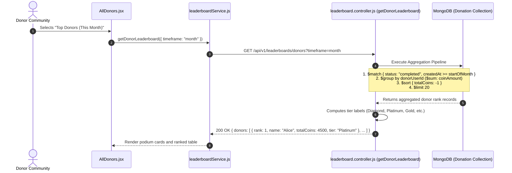

# Feature 14: Leaderboards, Donor Tiers & Gamified Badges

## 1. Executive Summary & Functional Overview
The **Leaderboards, Donor Tiers & Gamified Badges** module provides positive reinforcement and recognition for community philanthropy. By celebrating top contributors through dynamic rankings and tiered badges, Merch4Change gamifies giving, encouraging repeat community donations.

### Key Capabilities
- **Timeframe Leaderboards**: View rankings filtered by `week`, `month`, or `all_time`.
- **Automated Donor Tiers**:
  - 💎 **Diamond**: $\ge 5,000$ coins donated
  - 👑 **Platinum**: $\ge 2,000$ coins donated
  - 🥇 **Gold**: $\ge 500$ coins donated
  - 🥈 **Silver**: $\ge 100$ coins donated
  - 🥉 **Bronze**: $< 100$ coins donated
- **High-Performance Aggregation**: Computes rankings on-the-fly using MongoDB Aggregation Pipelines with indexed status and date matches.
- **Earned Digital Badges**: Users collect milestone badges showcased on their profile.

---

## 2. Architecture & Data Flow



---

## 3. Tier Calculation Engine

```javascript
export const getDonorTier = (totalCoins) => {
  if (totalCoins >= 5000) return { tier: "Diamond", color: "#60A5FA", bg: "#EFF6FF", icon: "💎" };
  if (totalCoins >= 2000) return { tier: "Platinum", color: "#A855F7", bg: "#FAF5FF", icon: "👑" };
  if (totalCoins >= 500) return { tier: "Gold", color: "#D97706", bg: "#FFFBEB", icon: "🥇" };
  if (totalCoins >= 100) return { tier: "Silver", color: "#4B5563", bg: "#F3F4F6", icon: "🥈" };
  return { tier: "Bronze", color: "#92400E", bg: "#FEF3C7", icon: "🥉" };
};
```

---

## 4. API Endpoints Reference

Base URL: `/api/v1/leaderboards`

### 1. Get Top Donors Leaderboard
- **Method**: `GET`
- **Route**: `/api/v1/leaderboards/donors`
- **Access**: Public
- **Query Parameters**:
  - `timeframe`: `"week" | "month" | "all_time"` (default: `"all_time"`)
  - `limit`: Integer (default: 20, max: 100)
- **Response (`200 OK`)**:
  ```json
  {
    "success": true,
    "data": {
      "donors": [
        {
          "rank": 1,
          "userId": "664f0f1a2b3c4d5e6f7a8b9c",
          "userName": "malith_s",
          "displayName": "Malith Sandanayake",
          "avatarUrl": "https://res.cloudinary.com/demo/avatar.png",
          "totalCoins": 5200,
          "donationCount": 18,
          "tier": {
            "tier": "Diamond",
            "icon": "💎",
            "color": "#60A5FA"
          }
        }
      ]
    }
  }
  ```
