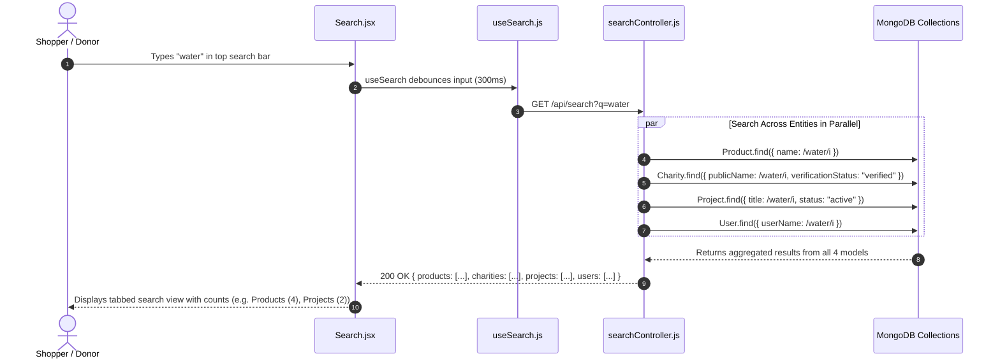

# Feature 15: Global Multi-Entity Search Engine

## 1. Executive Summary & Functional Overview
The **Global Multi-Entity Search Engine** provides a unified discovery interface across the entire Merch4Change ecosystem. Rather than requiring users to search products, charities, and creators in separate silos, a single search query scans across merchandise, verified non-profits, active fundraising campaigns, and community profiles.

### Key Capabilities
- **Parallel Cross-Collection Execution**: Dispatches asynchronous queries across `Product`, `Charity`, `Project`, and `User` collections via `Promise.all`.
- **Search Debouncing**: Frontend custom hook (`useSearch`) debounces keystrokes by 300ms to reduce unnecessary server load.
- **Categorized Search Results**: Formats responses into distinct tabs (All, Products, Charities, Projects, Users).
- **Verified Filtering**: Automatically filters search results to only return verified charities and active campaigns.

---

## 2. Architecture & Data Flow



---

## 3. API Endpoints Reference

Base URL: `/api/search`

### 1. Execute Multi-Entity Search
- **Method**: `GET`
- **Route**: `/api/search?q=water`
- **Access**: Public
- **Query Parameters**:
  - `q`: Search string (minimum 2 characters)
- **Success Response (`200 OK`)**:
  ```json
  {
    "success": true,
    "data": {
      "products": [
        {
          "_id": "67cb2a98f1234567890abcdef",
          "name": "Stainless Steel Water Bottle",
          "price": 28.00,
          "images": ["..."]
        }
      ],
      "charities": [
        {
          "_id": "664f1a2b3c4d5e6f7a8b9c0d",
          "publicName": "Water For Life Global",
          "category": "Disaster Relief",
          "logoUrl": "..."
        }
      ],
      "projects": [
        {
          "_id": "664f1b3c4d5e6f7a8b9c0e1f",
          "title": "Clean Water Boreholes",
          "goalAmount": 50000,
          "collectedAmount": 12500
        }
      ],
      "users": []
    }
  }
  ```

---

## 4. Frontend Integration (`code/Frontend/src/hooks/useSearch.js`)
```javascript
import { useState, useEffect } from "react";
import apiClient from "../api/apiClient";

export const useSearch = (query) => {
  const [results, setResults] = useState(null);
  const [loading, setLoading] = useState(false);

  useEffect(() => {
    if (!query || query.trim().length < 2) {
      setResults(null);
      return;
    }

    const timer = setTimeout(async () => {
      setLoading(true);
      try {
        const { data } = await apiClient.get(`/api/search?q=${encodeURIComponent(query)}`);
        setResults(data.data);
      } catch (err) {
        console.error("Search error:", err);
      } finally {
        setLoading(false);
      }
    }, 300);

    return () => clearTimeout(timer);
  }, [query]);

  return { results, loading };
};
```
