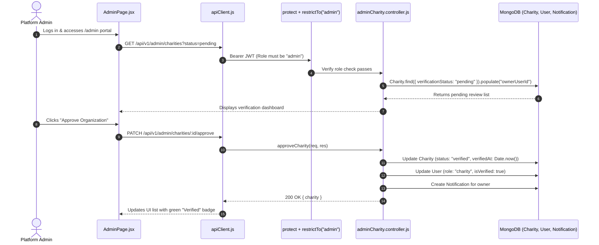

# Feature 16: Admin Moderation & Charity Verification Portal

## 1. Executive Summary & Functional Overview
The **Admin Moderation & Charity Verification Portal** serves as the compliance and governance cockpit of Merch4Change. It equips platform administrators with tools to review non-profit registration claims, inspect uploaded legal documentation, approve legitimate organizations, reject suspicious accounts with reason logs, and maintain system integrity.

### Key Capabilities
- **Pending Review Queue**: Paginated overview of all non-profit applications awaiting verification.
- **Detailed Entity Inspector**: Complete audit view of organization name, contact information, government registration numbers, and website credentials.
- **Approval Workflow**:
  - Sets `charity.verificationStatus = "verified"`.
  - Stamps `verifiedAt` and `verifiedByUserId`.
  - Promotes owner's user account: `role = "charity"`, `isVerified = true`.
  - Generates instant system notification to the organization.
- **Rejection Workflow**: Sets `verificationStatus = "rejected"` and records mandatory `rejectionReason` visible to the applicant.

---

## 2. Architecture & Approval Flow



---

## 3. API Endpoints Reference

Base URL: `/api/v1/admin`

### 1. List Charities for Review
- **Method**: `GET`
- **Route**: `/api/v1/admin/charities`
- **Access**: Protected (`protect`, `restrictTo("admin")`)
- **Query Parameters**:
  - `status`: `"pending" | "verified" | "rejected"` (default: `"pending"`)
  - `page`: Integer (default: 1)
  - `limit`: Integer (default: 20)
- **Success Response (`200 OK`)**:
  ```json
  {
    "success": true,
    "data": {
      "items": [
        {
          "_id": "664f1a2b3c4d5e6f7a8b9c0d",
          "publicName": "Community Reforestation Foundation",
          "registrationNumber": "NGO-LK-2024-8891",
          "category": "Environment",
          "verificationStatus": "pending",
          "ownerUserId": {
            "userName": "reforest_admin",
            "email": "contact@reforest.org"
          },
          "createdAt": "2026-09-05T14:30:00.000Z"
        }
      ],
      "total": 1,
      "page": 1
    }
  }
  ```

### 2. Approve Charity
- **Method**: `PATCH`
- **Route**: `/api/v1/admin/charities/:id/approve`
- **Access**: Protected (`protect`, `restrictTo("admin")`)
- **Response (`200 OK`)**:
  ```json
  {
    "success": true,
    "message": "Charity approved successfully.",
    "data": {
      "charity": {
        "_id": "664f1a2b3c4d5e6f7a8b9c0d",
        "verificationStatus": "verified",
        "verifiedAt": "2026-09-06T10:50:00.000Z"
      }
    }
  }
  ```

### 3. Reject Charity
- **Method**: `PATCH`
- **Route**: `/api/v1/admin/charities/:id/reject`
- **Access**: Protected (`protect`, `restrictTo("admin")`)
- **Request Body**:
  ```json
  {
    "rejectionReason": "Invalid tax registration identification number provided."
  }
  ```
- **Response (`200 OK`)**:
  ```json
  {
    "success": true,
    "message": "Charity rejected.",
    "data": {
      "charity": {
        "_id": "664f1a2b3c4d5e6f7a8b9c0d",
        "verificationStatus": "rejected",
        "rejectionReason": "Invalid tax registration identification number provided."
      }
    }
  }
  ```

---

## 4. Role Guard Enforcement
The [`auth.js`](file:///home/malith-sandanayake/projects/2yp/e23-co2060-Merch4Change/code/Backend/src/middlewares/auth.js) middleware restricts admin routes:
```javascript
export const restrictTo = (...roles) => {
  return (req, res, next) => {
    if (!roles.includes(req.user.role)) {
      throw new AppError("You do not have permission to perform this action.", 403, "FORBIDDEN");
    }
    next();
  };
};
```
Attempts by non-admin users to invoke `/api/v1/admin/*` immediately return `403 Forbidden`.
