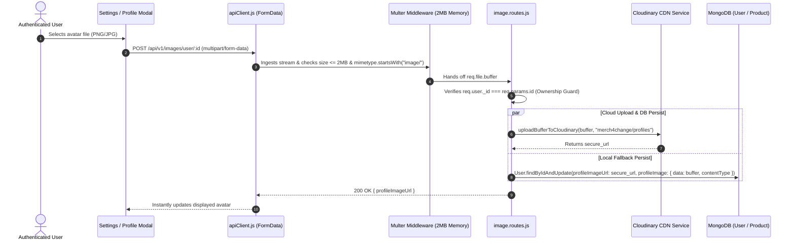

# Feature 17: Cloud Media Upload Pipeline

## 1. Executive Summary & Functional Overview
The **Cloud Media Upload Pipeline** handles binary asset ingestion for Merch4Change. It supports product showcase imagery, user avatars, profile covers, and charity campaign documentation using an efficient **hybrid ingestion model** powered by **Multer** and **Cloudinary CDN**.

### Key Capabilities
- **In-Memory Streaming**: Multer buffers uploaded files in RAM (`memoryStorage`) with strict 2MB limits and MIME-type validation.
- **Cloudinary CDN Storage**: Uploads buffers asynchronously to Cloudinary cloud buckets, returning optimized, SSL-secured CDN URLs.
- **Resilient Fallback Storage**: Stores binary image data in MongoDB (`Buffer` + `contentType`) as a safety net if cloud upload services experience interruptions.
- **Direct Stream Serving**: Endpoints serve binary images directly with appropriate `Content-Type` response headers for legacy or fallback clients.

---

## 2. Architecture & Data Flow



---

## 3. Implementation Details

### Multer Ingestion Configuration (`code/Backend/src/routes/image.routes.js`)
```javascript
import multer from "multer";

const storage = multer.memoryStorage();
const upload = multer({
  storage,
  limits: { fileSize: 2 * 1024 * 1024 }, // 2MB Limit
  fileFilter: (req, file, cb) => {
    if (file.mimetype.startsWith("image/")) {
      cb(null, true);
    } else {
      cb(new Error("Only image files are allowed"), false);
    }
  },
});
```

---

## 4. API Endpoints Reference

Base URL: `/api/v1/images`

### 1. Upload User Avatar
- **Method**: `POST`
- **Route**: `/api/v1/images/user/:id`
- **Access**: Protected (`protect`, Owner Only)
- **Headers**: `Content-Type: multipart/form-data`
- **Body**: `image: <Binary File>`
- **Response (`200 OK`)**:
  ```json
  {
    "message": "Profile image uploaded successfully",
    "profileImageUrl": "https://res.cloudinary.com/demo/image/upload/v1725619200/merch4change/profiles/user123.jpg"
  }
  ```

### 2. Upload Profile Cover Banner
- **Method**: `POST`
- **Route**: `/api/v1/images/user/:id/cover`
- **Access**: Protected (`protect`, Owner Only)

### 3. Upload Product Image
- **Method**: `POST`
- **Route**: `/api/v1/images/product/:id`
- **Access**: Protected (`protect`)

### 4. Direct Binary Image Stream (Fallback)
- **Method**: `GET`
- **Route**: `/api/v1/images/user/:id` or `/api/v1/images/product/:id`
- **Response**: Binary image stream with `Content-Type: image/jpeg` or `image/png`.

---

## 5. Security & Validation
1. **Ownership Check**: Prevents users from overwriting another user's avatar:
   ```javascript
   if (req.user._id.toString() !== req.params.id.toString()) {
     return res.status(403).json({ message: "Forbidden" });
   }
   ```
2. **Memory Quota Protection**: Prevents Denial-of-Service (DoS) buffer overflows by enforcing a hard 2MB limit per upload.
