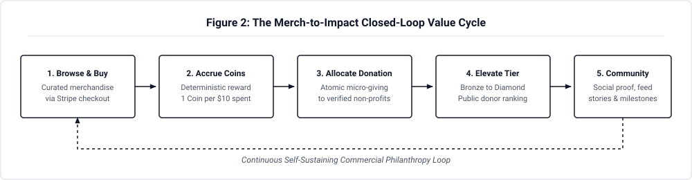
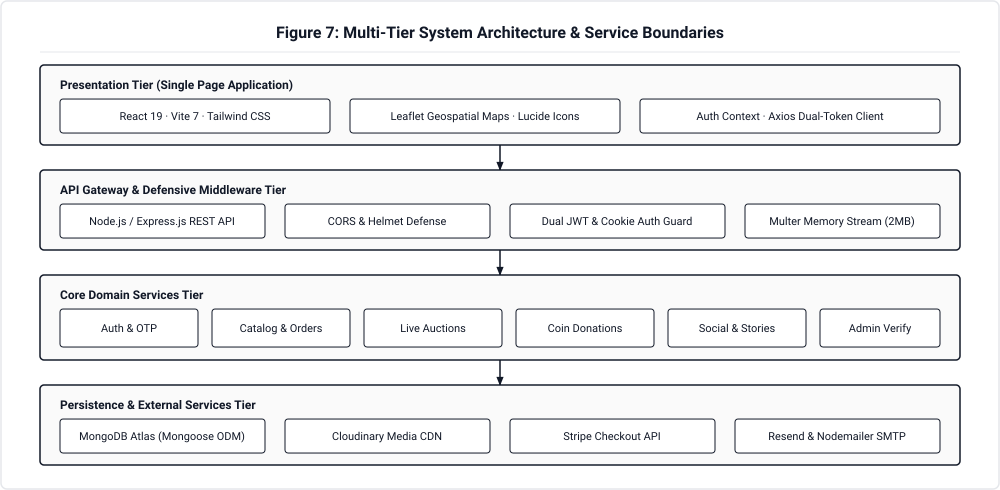
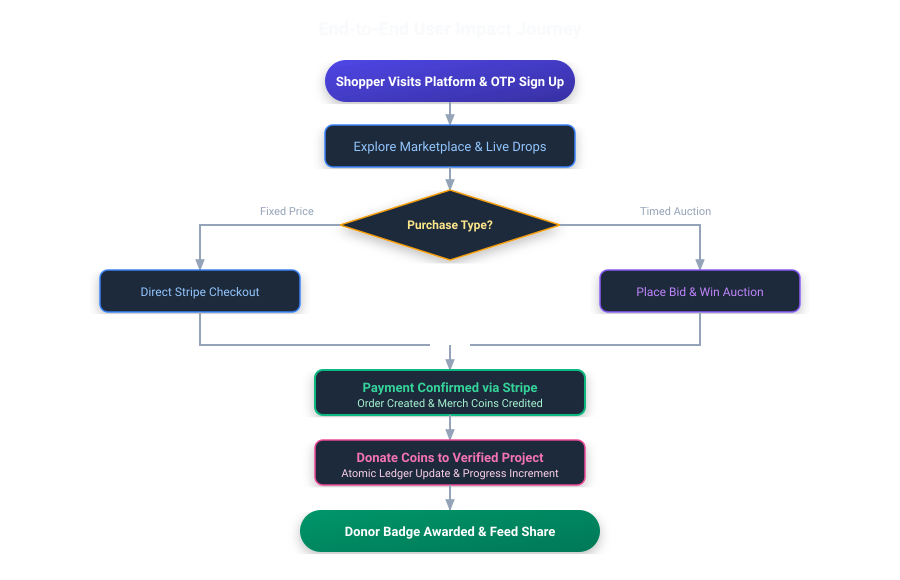
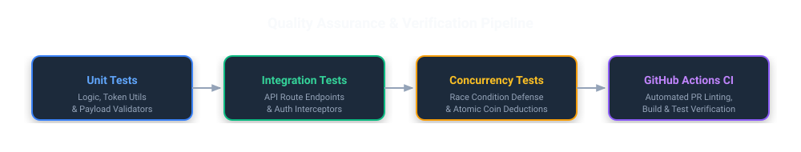

<div align="center">


# 🛍️ Merch4Change

### *Shop with purpose. Give with every purchase.*

A multi-sided social commerce platform bridging **conscious shoppers**, **merchants & creators**, and **verified charities** — turning everyday merchandise shopping into measurable social impact.

**[🌐 Live Platform](https://merch4change.vercel.app/)** · **[📚 Technical Docs](./Documentation/dev%20docs/Documents.md)** · **[🛠️ Developer Guide](./DEVELOPER_GUIDE.md)** · **[🧪 Testing Guide](./code/Backend/TESTING.md)** · **[📁 Folder Structure](./FOLDER_STRUCTURE.md)**

<br/>


</div>

---

## 🌟 The Core Concept: Merch-to-Impact

Traditional philanthropy is often siloed from routine retail spending. **Merch4Change** connects e-commerce directly with transparent non-profit giving:

1. **Shop Curated Merch:** Purchase brand apparel, creator drops, or participate in live timed auctions via secure Stripe card checkout.
2. **Earn Merch Coins:** For every merchandise purchase, users automatically receive in-app Merch Coins ($\lfloor \text{USD} / 10 \rfloor$).
3. **Fund Verified Causes:** Donate coins atomically to admin-verified charities and community projects.
4. **Build Social Reputation:** Donors unlock achievement tiers (Bronze $\rightarrow$ Diamond), public leaderboard rankings, and profile badges.

<div align="center">



</div>

---

## 🏛️ System Architecture

Merch4Change is built on a modular three-tier architecture with clear separation of concerns, defensive security controls, and stateless JWT session handling:

<div align="center">



</div>

### Architectural Highlights

| Layer | Technologies | Key Capabilities |
|---|---|---|
| **Presentation Tier** | React 19 · Vite 7 · Tailwind CSS | Single Page App, dark/light themes, optimistic UI updates, Lucide icons. |
| **Geospatial & Visuals** | Leaflet · React-Leaflet · OpenStreetMap | Interactive global map rendering verified charity headquarters worldwide. |
| **API Gateway Tier** | Node.js (>=18) · Express.js 4 | RESTful endpoints (`/api/v1`), helmet security headers, rate limiting, CORS whitelisting. |
| **Session Security** | Dual-Token JWT (Memory + HttpOnly Cookie) | Short-lived access token in React memory, 7-day auto-rotating refresh token in `HttpOnly` cookie. |
| **Persistence Tier** | MongoDB Atlas · Mongoose 8 ODM | Flexible JSON document collections with indexing, aggregation pipelines, and atomic updates. |
| **Cloud Services** | Stripe API · Cloudinary CDN · Resend & Nodemailer | PCI-compliant payments, in-memory media streaming (2MB limit), dual email dispatch. |

---

## ⚡ Core Feature Matrix

<table width="100%">
  <tr>
    <td width="50%" valign="top">
      <h3>🛍️ Multi-Vendor Marketplace</h3>
      <ul>
        <li>Curated brand storefronts &amp; independent creator drops</li>
        <li>Category filtering, price sorting, and dynamic search</li>
        <li>Production-grade Stripe Checkout Sessions</li>
        <li>Instant receipt breakdown with earned Merch Coins</li>
      </ul>
    </td>
    <td width="50%" valign="top">
      <h3>⚡ Timed Auctions &amp; Live Bidding</h3>
      <ul>
        <li>Exclusive creator items and limited charity drops</li>
        <li>Dynamic countdown timers &amp; real-time bid feeds</li>
        <li>Automated minimum increment validation</li>
        <li>Instant outbid notifications to prior high-bidders</li>
      </ul>
    </td>
  </tr>
  <tr>
    <td width="50%" valign="top">
      <h3>🪙 Impact Coin Economy</h3>
      <ul>
        <li>Deterministic reward accrual: 1 coin per $10 spent</li>
        <li>ACID-compliant atomic micro-donations</li>
        <li>Direct project crowdfunding with goal progress meters</li>
        <li>Concurrency-safe balance deduction guards</li>
      </ul>
    </td>
    <td width="50%" valign="top">
      <h3>🛡️ Verified Charity Governance</h3>
      <ul>
        <li>Statutory certificate upload &amp; audit review queue</li>
        <li>Admin moderation portal (Approve / Reject / Notes)</li>
        <li>Verified green checkmark status badge</li>
        <li>Interactive Leaflet HQ map pins across countries</li>
      </ul>
    </td>
  </tr>
  <tr>
    <td width="50%" valign="top">
      <h3>💬 Social Community &amp; Stories</h3>
      <ul>
        <li>Algorithmic recommendation feed with decay scoring</li>
        <li>Optimistic post likes &amp; threaded comments</li>
        <li>24-hour auto-expiring media stories &amp; highlights</li>
        <li>Polymorphic profiles for shoppers, brands, and NGOs</li>
      </ul>
    </td>
    <td width="50%" valign="top">
      <h3>🏆 Leaderboards &amp; Real-Time Chat</h3>
      <ul>
        <li>Ranked donor tiers: Bronze, Silver, Gold, Platinum, Diamond</li>
        <li>Dynamic timeframes: Weekly, Monthly, All-Time</li>
        <li>1-on-1 private messaging with unread badge counters</li>
        <li>In-app notification center for orders, likes, and bids</li>
      </ul>
    </td>
  </tr>
</table>

---

## 🔄 End-to-End User Impact Journey

<div align="center">



</div>

---

## 🚀 Quickstart Guide

Get the full-stack platform running locally in three simple steps:

### 1. Clone & Install Dependencies
```bash
git clone https://github.com/cepdnaclk/e23-co2060-Merch4Change.git
cd e23-co2060-Merch4Change

# Install Backend dependencies
cd code/Backend && npm install

# Install Frontend dependencies
cd ../Frontend && npm install
```

### 2. Configure Environment Variables
Copy `.env.example` to `.env` in both folders:

```bash
# In code/Backend/
cp .env.example .env

# In code/Frontend/
echo "VITE_API_URL=http://localhost:5000" > .env
```

*(See [DEVELOPER_GUIDE.md](./DEVELOPER_GUIDE.md#5-environment-variables-reference) for the full variable dictionary).*

### 3. Seed Database & Launch Development
```bash
# Seed mock products, charities, and users (from code/Backend)
cd code/Backend
node src/scripts/seed.js

# Terminal 1: Launch Backend API (http://localhost:5000)
npm run dev

# Terminal 2: Launch Frontend Client (http://localhost:5173)
cd ../Frontend && npm run dev
```

---

## 🧪 Testing & Quality Assurance

The codebase is tested across component logic, endpoint integration, and concurrency constraints:

<div align="center">



</div>

```bash
# Run all 205 backend unit tests
cd code/Backend && npm test

# Run tests in watch mode
npm run test:watch

# Run all tests (unit + integration)
npm run test:all

# Run frontend test suite
cd ../Frontend && npm test
```

> **Automated CI:** Every push and pull request triggers our [GitHub Actions CI Pipeline](https://github.com/cepdnaclk/e23-co2060-Merch4Change/actions) enforcing ESLint rules, unit tests, and production build checks.

---

## 📁 Repository Structure

```
e23-co2060-Merch4Change/
├── code/
│   ├── Backend/          # Node.js + Express REST API (Models, Controllers, Services)
│   └── Frontend/         # React 19 + Vite + Tailwind CSS SPA
├── Documentation/        # Comprehensive Developer Guide & 17 Technical Feature Specs
│   ├── dev docs/         # In-depth architectural feature documentation
│   └── Scrum Records/    # Sprints 1–7 Agile meeting records
├── docs/                 # Academic GitHub Pages Showcase (Jekyll Theme)
│   ├── data/             # Metadata for projects.ce.pdn.ac.lk crawler
│   ├── images/           # SVG Flowcharts, Cover & Thumbnail assets
│   └── README.md         # Official academic project documentation
├── DEVELOPER_GUIDE.md    # Complete system handbook & engineering manual
├── FOLDER_STRUCTURE.md   # Exhaustive directory tree documentation
└── README.md             # Project showcase (this file)
```

---

## 👨‍💻 Team Antigravity

Developed as a 2nd Year Project (**CO2060 — Software Systems Design Project**)  
**Department of Computer Engineering · Faculty of Engineering · University of Peradeniya, Sri Lanka**

### Project Leadership
| Role | Name |
|---|---|
| **Tech Lead** | **R.A.J.C. Adhikari** |
| **Scrum Master** | **M.N.A. Fikry** |

### Development Team
| eNumber | Name | Role | Email |
|---|---|---|---|
| **E/23/050** | **G.C. Damsiluni** | Frontend Developer & UI/UX Specialist | [e23050@eng.pdn.ac.lk](mailto:e23050@eng.pdn.ac.lk) |
| **E/23/089** | **M.A.S. Dulshara** | Database Manager & Systems Engineer | [e23089@eng.pdn.ac.lk](mailto:e23089@eng.pdn.ac.lk) |
| **E/23/343** | **S.B.N.S. Samarawickrama** | Backend Developer & API Architect | [e23343@eng.pdn.ac.lk](mailto:e23343@eng.pdn.ac.lk) |
| **E/23/347** | **S.D.M.P. Sandanayake** | Team Leader & Full-Stack Engineer | [e23347@eng.pdn.ac.lk](mailto:e23347@eng.pdn.ac.lk) |

---

## 📄 License & Acknowledgements

This project is open-source and licensed under the [MIT License](LICENSE).

Special thanks to the academic staff and instructors of the **Department of Computer Engineering, University of Peradeniya** for their invaluable guidance throughout the design and execution of this project.

<div align="center">

Made with ❤️ by **Team Antigravity** · University of Peradeniya · Batch E23  
*"Shop with purpose. Give with every purchase."*

</div>
