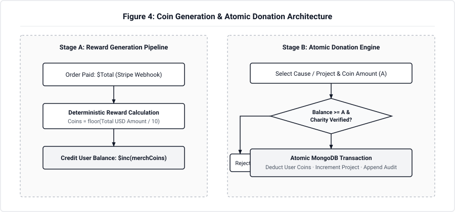
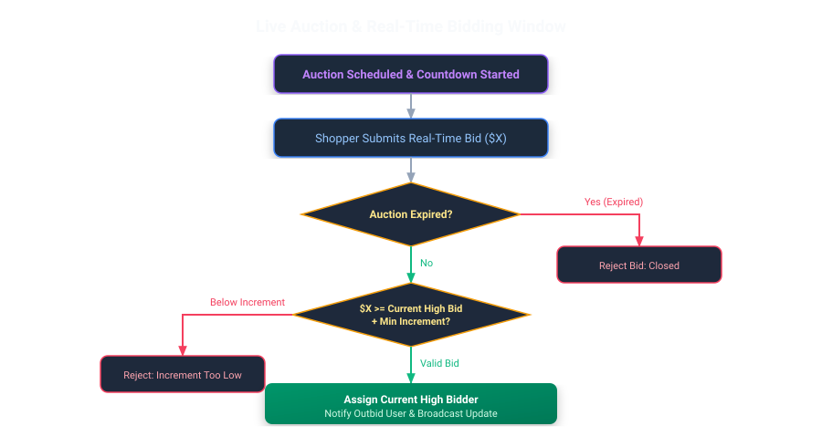
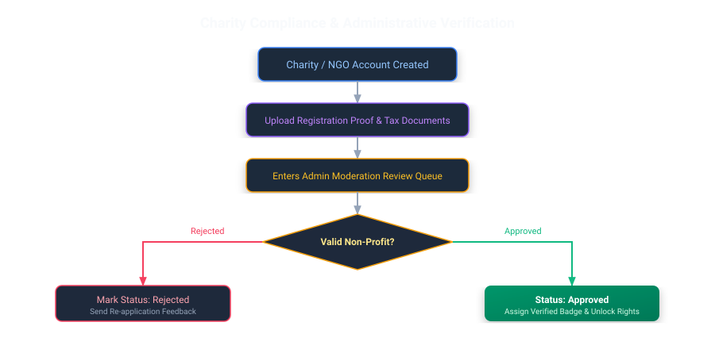
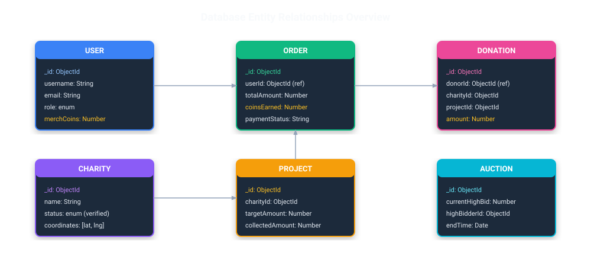
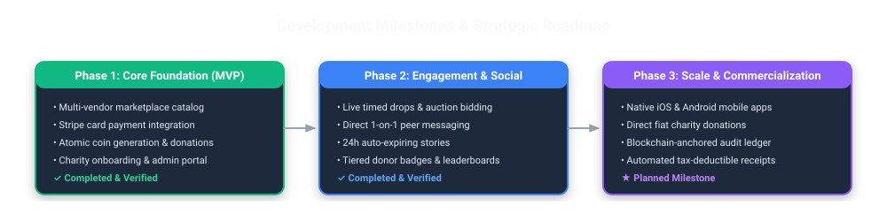

# Merch4Change

### *Shop with purpose. Give with every purchase.*

A multi-sided social commerce ecosystem bridging **conscious consumers**, **ethical brands & creators**, and **verified charities** — turning everyday merchandise purchases into measurable social impact.

[Live Demo](https://merch4change.vercel.app/) · [GitHub Repository](https://github.com/cepdnaclk/e23-co2060-Merch4Change) · [Technical Documentation](https://github.com/cepdnaclk/e23-co2060-Merch4Change/tree/main/Documentation)

 

---

## Team

**Department of Computer Engineering**, Faculty of Engineering, **University of Peradeniya**  
*CO2060 — Software Systems Design Project (2YP) · Batch E23*

| eNumber | Name | Role | Email |
|---|---|---|---|
| **E/23/050** | G.C. Damsiluni | Frontend Developer & UI/UX Designer | [e23050@eng.pdn.ac.lk](mailto:e23050@eng.pdn.ac.lk) |
| **E/23/089** | M.A.S. Dulshara | Database Manager & Systems Engineer | [e23089@eng.pdn.ac.lk](mailto:e23089@eng.pdn.ac.lk) |
| **E/23/343** | S.B.N.S. Samarawickrama | Backend Developer & API Architect | [e23343@eng.pdn.ac.lk](mailto:e23343@eng.pdn.ac.lk) |
| **E/23/347** | S.D.M.P. Sandanayake | Team Leader & Full-Stack Developer | [e23347@eng.pdn.ac.lk](mailto:e23347@eng.pdn.ac.lk) |

---

## Table of Contents

1. [Executive Summary & Problem Statement](#1-executive-summary--problem-statement)
2. [Proposed Solution & Core Value Loop](#2-proposed-solution--core-value-loop)
3. [Multi-Sided Stakeholder Roles](#3-multi-sided-stakeholder-roles)
4. [Key Product Capabilities](#4-key-product-capabilities)
5. [Process Workflows & System Flowcharts](#5-process-workflows--system-flowcharts)
   - [5.1 End-to-End User Impact Journey](#51-end-to-end-user-impact-journey)
   - [5.2 Coin Reward & Donation Engine](#52-coin-reward--donation-engine)
   - [5.3 Live Auction & Real-Time Bidding](#53-live-auction--real-time-bidding)
   - [5.4 Charity Verification & Compliance Pipeline](#54-charity-verification--compliance-pipeline)
6. [System Architecture & Technology Stack](#6-system-architecture--technology-stack)
   - [6.1 High-Level Architecture](#61-high-level-architecture)
   - [6.2 Technology Matrix](#62-technology-matrix)
   - [6.3 Data Model Entity Relationships](#63-data-model-entity-relationships)
7. [Security & Engineering Highlights](#7-security--engineering-highlights)
8. [Testing & Quality Assurance](#8-testing--quality-assurance)
9. [Conclusion & Future Roadmap](#9-conclusion--future-roadmap)
10. [Links & Resources](#10-links--resources)

---

## 1. Executive Summary & Problem Statement

### 1.1 The Problem
In contemporary e-commerce and social advocacy, three critical challenges persist:

1. **Disconnected Consumer Giving:** Conscious consumers wish to support charitable initiatives, but separate donation channels create friction and lack instant gratification.
2. **Charity Trust & Visibility Deficit:** Grassroots charities and non-profit initiatives struggle with public discoverability and face high donor skepticism regarding fund transparency and verification.
3. **Lack of Tangible CSR for Creators & Brands:** Brands and merchandise creators often want to express corporate social responsibility, yet lack unified platforms to show exactly how their product lines drive measurable social good.

### 1.2 The Opportunity
By unifying **brand merchandise sales**, **instant micro-donation incentives**, and **rigorous non-profit verification**, **Merch4Change** creates a sustainable, self-reinforcing flywheel where commerce fuels philanthropy.

---

## 2. Proposed Solution & Core Value Loop

**Merch4Change** introduces a proprietary **Merch-to-Impact Model**:
- When consumers buy merchandise through integrated Stripe checkout, they instantly earn **Merch Coins** ($\lfloor \text{USD} / 10 \rfloor$).
- These coins can be directly donated to **admin-verified charities** and specific community development projects.
- Donors earn tiered status badges (Bronze, Silver, Gold, Platinum, Diamond) and public recognition across leaderboards, community feeds, and profile showcases.

---

## 3. Multi-Sided Stakeholder Roles

The platform provides dedicated, tailored experiences for four distinct personas:

| Stakeholder | Role & Capabilities |
|---|---|
| **Conscious Shoppers** | Browse products, place live bids in limited charity drops, complete secure card payments, earn Merch Coins, donate to verified projects, view donor tier rankings, interact with community feeds and 24h stories. |
| **Brands & Creators** | Manage digital storefronts, upload curated merchandise catalogs, schedule limited-edition drops, and demonstrate transparent CSR impact to their followers. |
| **Charities & NGOs** | Submit formal registration documents for admin verification, earn a verified green checkmark, publish targeted fundraising campaigns, accept coin donations, and showcase headquarters on interactive maps. |
| **Platform Admins** | Inspect charity proof documents, approve/reject non-profit verification applications, monitor platform transactions, and maintain community safety. |

---

## 4. Key Product Capabilities

### Curated Multi-Vendor Marketplace
- **Dynamic Catalog:** Multi-brand merchandise catalog supporting filtering by category, price ranges, and vendor types.
- **Fast Cart & Order Handling:** Seamless basket calculations, stock checks, and instant receipt generation.
- **Stripe Integration:** Production-grade checkout sessions supporting secure global payments.

### Timed Auctions & Real-Time Bidding
- **Limited Drops:** Exclusive charity auctions and rare creator items.
- **Dynamic Bidding Engine:** Countdown timers, automated minimum increment validation, and instant high-bidder updates.

### Impact Coin Economy & Project Funding
- **Atomic Micro-Donations:** Concurrency-safe coin donation processing directly to charities or targeted project campaigns.
- **Progress Tracking:** Real-time goal meters showcasing community funding status.

### Verified Non-Profit Governance & Mapping
- **Documented Verification:** Charities must upload official tax and registration credentials for admin audit before raising funds.
- **HQ Geolocation:** Interactive map powered by Leaflet and OpenStreetMap showing charity headquarters worldwide.

### Social Community, Stories & Messaging
- **Interactive Feed:** Rich multimedia posts with optimistic likes, threaded comments, and follower affinity ranking.
- **24-Hour Stories:** Auto-expiring ephemeral updates and permanent profile highlights.
- **Direct 1-on-1 Messaging:** Real-time messaging with unread badges and conversation management.

---

## 5. Process Workflows & System Flowcharts

### 5.1 End-to-End User Impact Journey

The complete lifecycle from user onboarding to societal impact:

---

### 5.2 Coin Reward & Donation Engine

Coins are disbursed upon verified purchases and donated with atomic database guarantees:

---

### 5.3 Live Auction & Real-Time Bidding

The auction system guarantees fair increments, active window enforcement, and high-bidder tracking:

---

### 5.4 Charity Verification & Compliance Pipeline

To ensure absolute donor confidence, non-profits undergo strict administrative auditing:

---

## 6. System Architecture & Technology Stack

### 6.1 High-Level Architecture

**Merch4Change** is built on a clean three-tier full-stack architecture with modular services and strict middleware boundaries:

---

### 6.2 Technology Matrix

| Layer | Technologies | Justification |
|---|---|---|
| **Frontend UI** | React 19, Tailwind CSS, Vite, Lucide Icons | Ultra-fast build times, modern component primitives, and highly responsive styling. |
| **Mapping & Visuals** | React-Leaflet, OpenStreetMap | Interactive, zero-cost, open-source geospatial visualization for global charity HQs. |
| **Backend API** | Node.js, Express.js | Event-driven, asynchronous I/O ideal for real-time commerce, social feeds, and micro-donations. |
| **Database** | MongoDB Atlas, Mongoose ODM | Flexible JSON document model suited for polymorphic user profiles, media posts, and order history. |
| **Authentication** | Dual JWT (Access Token + HttpOnly Cookie) | Enterprise-grade stateless authorization with protection against XSS and CSRF token interception. |
| **Payment Gateway** | Stripe Checkout API | Industry standard, PCI-DSS compliant payment processing for credit and debit cards. |
| **Media Pipeline** | Cloudinary REST API, Multer (Memory Storage) | Ephemeral in-memory file buffers piped directly to cloud CDN without storing disk artifacts on servers. |
| **Email Delivery** | Resend API & Nodemailer (SMTP) | Dual transactional mail system ensuring prompt OTP code deliveries with automatic fallback. |

---

### 6.3 Data Model Entity Relationships

---

## 7. Security & Engineering Highlights

- **Dual-Token Authentication:** Short-lived access JWTs stored in memory combined with secure `HttpOnly`, `SameSite=Lax` refresh token cookies prevent credential harvesting.
- **Atomic Operations & Race Condition Prevention:** All coin deductions, auction high-bidder assignments, and project goal updates utilize atomic database operations to prevent double-spending.
- **Memory-Buffered Media Pipeline:** Uploads pass through Multer's in-memory storage buffer with a strict 2MB limit before being streamed to Cloudinary, ensuring zero malicious files are written to host disk storage.
- **Defensive API Hardening:** Built-in rate limiting (`express-rate-limit`), security headers (`helmet`), parameter sanitization, and explicit CORS origin whitelisting.

---

## 8. Testing & Quality Assurance

The codebase adheres to rigorous testing methodologies spanning unit, integration, and security checks:

- **Unit & Integration Testing:** Automated test suites using Jest and Supertest validating all major route groups (Auth, Marketplace, Donations, Auctions).
- **Concurrency & Ledger Verification:** Automated scripts simulating parallel donation requests to ensure user coin balances never fall below zero.
- **Continuous Integration (CI):** Every pull request to `main` or `dev` triggers GitHub Actions workflows enforcing linting standards, build correctness, and unit tests.

---

## 9. Conclusion & Future Roadmap

**Merch4Change** successfully proves that everyday consumer spending can be directly redirected into social progress through thoughtful UX, atomic token mechanics, and transparent non-profit verification.

---

## 10. Links & Resources

- **Live Application:** [merch4change.vercel.app](https://merch4change.vercel.app/)
- **GitHub Repository:** [github.com/cepdnaclk/e23-co2060-Merch4Change](https://github.com/cepdnaclk/e23-co2060-Merch4Change)
- **Developer Guide:** [DEVELOPER_GUIDE.md](https://github.com/cepdnaclk/e23-co2060-Merch4Change/blob/main/DEVELOPER_GUIDE.md)
- **Backend Testing Guide:** [code/Backend/TESTING.md](https://github.com/cepdnaclk/e23-co2060-Merch4Change/blob/main/code/Backend/TESTING.md)
- **Department of Computer Engineering:** [ce.pdn.ac.lk](https://www.ce.pdn.ac.lk/)
- **Faculty of Engineering, University of Peradeniya:** [eng.pdn.ac.lk](https://eng.pdn.ac.lk/)

---

Developed by **Team Antigravity** · University of Peradeniya · E23 Batch  
*CO2060 — Software Systems Design Project (2YP)*

